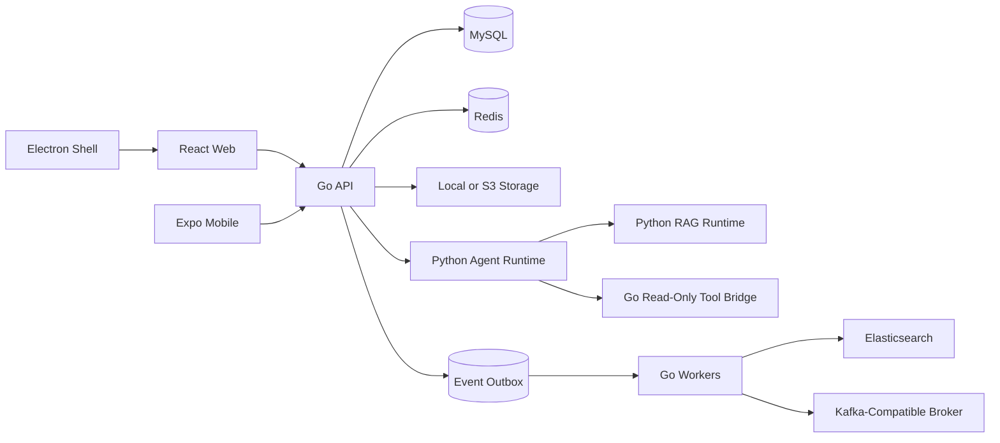

# System Overview

AllCallAll is a realtime collaboration platform composed of a Go product
backend, three client surfaces, and separate Python Agent/RAG runtimes.

## System Boundary

The Go backend is authoritative for users, organizations, conversations,
meetings, transcripts, permissions, approvals, audit records, and all product
writes. The Python runtime owns orchestration, retrieval planning, grounding,
citations, traces, tool proposals, and evaluation.

## Product Flows

### Collaboration and Realtime Delivery

HTTP requests write canonical state to MySQL. Realtime events are also stored
as recipient-scoped replay records before live WebSocket delivery, allowing a
client to reconnect with `since_id` and recover missed events. Redis supports
presence and multi-instance coordination.

The collaboration WebSocket endpoint and WebRTC signaling endpoint are
separate protocols. See the [API reference](../reference/api/http-api.md) for
their current routes.

### Meetings, Recordings, and Transcripts

Meeting state and recording metadata are Go-owned. Recording files use local or
S3-compatible storage. Stopping a recording can enqueue a transcription event;
the worker calls the configured provider and persists timestamped meeting
transcript segments. A transcription failure does not roll back the recording.

### Agent Execution

The backend validates organization and conversation access, creates an
idempotent run, and dispatches work through the outbox. Python may orchestrate
the run and call authorized read-only tools. Any requested write is returned as
a proposal and must pass the Go approval and audit path before execution.

## Reliability Model

- Outbox handlers use idempotency keys, attempts, and claim leases.
- Agent runs have explicit pending, running, ready, and failed states.
- Search indexes are eventually consistent read models, never authorization
  boundaries.
- Recording, transcription, and cleanup failures are isolated and retryable.
- Request identifiers are persisted into asynchronous work for correlation.

## Deployment Shapes

Local development can run the API with embedded workers. The same worker code
can be launched as separate processes for Agent execution, general outbox work,
search indexing, settlement consumption, and cleanup. Compose is the reference
local topology; Kubernetes and Helm assets are available but require
environment-specific validation.

See [Workers and Processes](workers.md), the [deployment guide](../guides/deployment/deployment-guide.md),
and the [Python runtime](https://github.com/XianingY/allcallall-agent-runtime).
