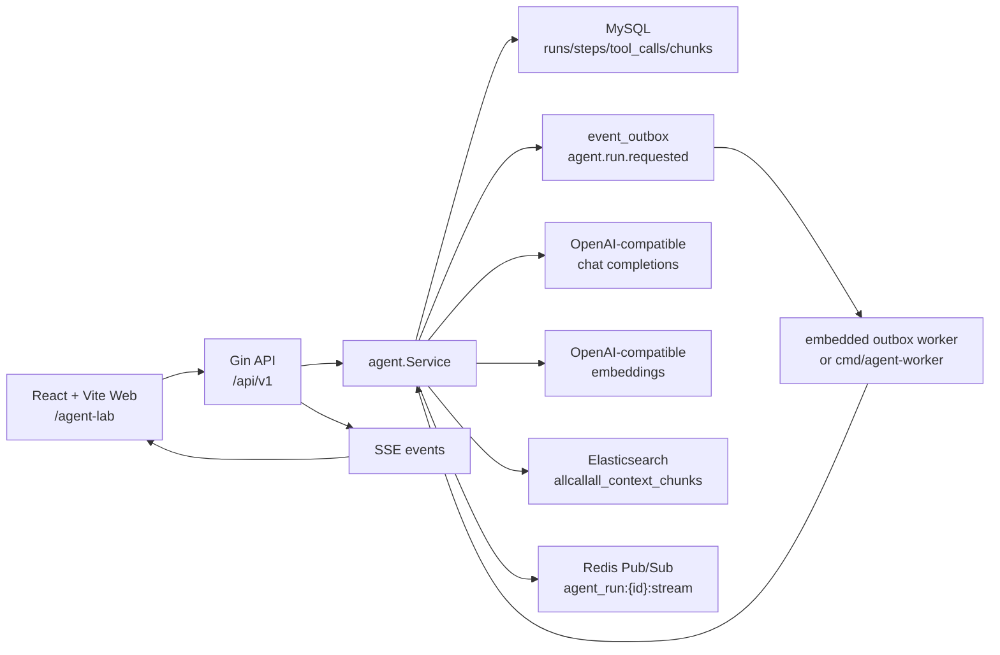

# AllCallAll Agent + ES Vector RAG 当前状态说明

更新时间：2026-06-18

本文完全从当前代码实现出发，说明 AllCallAll 现在在 Web 端 Agent、Agent 编排、工具调用、RAG、ES vector 检索、可演示能力和边界上的真实状态。它可以作为后续开发计划、面试复盘和本地调试手册的共同基准。

## 结论先行

当前项目最适合展示的方向是：**Web Agent Lab + ES vector RAG + Workflow 控制的多 Agent 协作**。

它已经不是只有后端概念的半成品。现在 Web 端登录后默认进入 `Agent Lab`，可以上传/粘贴/抓取知识源，查看 ingestion/index 状态和 dead-letter，启动固定 Workflow Agent run，观察任务图、并行角色、agent message、tool approval，并在审批后把结果写回会话。

但它也还不是生产级 Agent 平台。当前重点是本地 demo 和工程化闭环：Workflow 是内置固定 DAG，不是 Temporal；RAG ingestion 支持轻量文件/URL/manual text，不做 Notion/GitHub/站点批量 crawler；ES 继续作为 vector 检索引擎，但 eval 使用 fake vector indexer 保证本地可跑。

一句话定位：

> 这是一个可以本地演示和调试的 Agent 工程化项目，核心亮点是把 organization/conversation 知识库、会话上下文、ES vector RAG、Workflow 任务图、并行 Agent、人工审批和 eval 回归串成一个可见产品。

## 当前可演示能力

| 模块 | 当前状态 | 真实能力 | 主要边界 |
| --- | --- | --- | --- |
| Web Agent Lab | 可演示 | 独立 `web/` 应用提供 `/agent-lab`；含 Run/Trace/Citations/Approvals/History 展示，并可跳转 Knowledge Center | 需要登录态和当前 organization，不是免登录公开 demo |
| Agent run 生命周期 | 基本完整 | 创建 run、幂等键、pending/running/ready/failed/requires_action、lease、attempt、outbox worker 执行 | worker 可靠性和失败重放还偏本地开发级 |
| Workflow+Agent 编排 | 可演示 | 固定 DAG：`collect_context -> decompose -> parallel_agents -> merge -> propose_tools -> approval -> commit_result`；部分 role task 内部运行 bounded ReAct | DAG 目前固定，不支持用户自定义 workflow |
| 并行多 Agent | 可演示 | `searcher/summarizer/risk_analyst` 三个 workflow task 并行执行；`searcher`/`risk_analyst` 使用 read-only bounded ReAct，并通过 `agent_messages` 持久化计划、观察和结果 | 当前 role loop 是固定策略，不是完全自治 agent |
| 工具调用 | 已收紧 | 8 个后端托管工具；工具 schema 已改为严格 JSON Schema；模型参数执行前校验 | ReAct 老 run 仍保留，主 demo 推荐走 Workflow |
| 人工审批 | 已接入 | 写工具 `write_conversation_message/create_follow_up_task/upsert_agent_memory/delegate_task` 默认需要审批；owner/admin 可审批 | 审批策略首版按 org role + tool policy，UI 只做 approve/reject |
| RAG 知识库 | 已可用 | 新增 `rag_sources/rag_source_versions/rag_chunks`；支持 manual text、URL、txt/md/html/pdf file ingestion | 文件 5MB、URL 2MB/10s；PDF 用 Go 依赖解析 |
| RAG 分段/版本/去重 | 已实现 | 归一化后约 900 字符 chunk、120 overlap；source 原文 hash 不变跳过；同 version content hash 去重 | 分段策略固定，尚无 UI 配置 |
| Index retry/dead-letter | 已实现 | `rag.source.ingest_requested` 和 `rag.chunk.index_requested` 走 event_outbox；failed 即 dead-letter，可 Web 重试 | 依赖 outbox worker 或 API embedded worker |
| ES vector | 已接入 | `allcallall_context_chunks` 使用 `dense_vector`、`index=true`、`cosine`，查询用 `cosineSimilarity` | ES 在本项目中承担向量数据库角色，不另引 Milvus/Pinecone |
| 引用/citation | 可点击 | citation 返回 chunk/source/origin/conversation/version/retrieval_mode/score/snippet；Web 可打开知识源 preview 或 URL | 消息/备注回源目前先回到 conversation 维度，细粒度滚动定位未做 |
| Eval | 本地可跑 | `cmd/agent-eval` 支持 planner/workflow fixture；`cmd/rag-eval` 支持 vector/fallback/citation fixture；组合报告覆盖 bounded role ReAct + meeting transcript | 尚未接入 CI，也没有在线 Eval API |
| SSE/trace | 可展示 | 前端通过 SSE 看 run/step/tool 事件，结果页也可从持久化 trace 回放 | token 级流式在当前 tool-calling 模式下基本不会触发 |

## 运行架构

本地 demo 的最小闭环是：



关键点：

- API server 在启动时初始化 Agent service、planner、chunk indexer、Redis stream publisher，并注册 Agent outbox handler。
- 如果 `EMBEDDED_WORKERS` 为空、`1`、`true` 或 `yes`，API 进程会内嵌 outbox worker，本地 Web demo 不一定需要另起 `agent-worker`。
- `cmd/agent-worker` 仍然存在，适合把 Agent 执行从 API 进程拆出去。
- `ELASTICSEARCH_URL` 存在时，API server 和 agent worker 都会初始化 `allcallall_context_chunks` vector index。

相关代码：

- `backend/cmd/server/main.go`：组装 Agent service、planner、chunk indexer、Redis stream、outbox worker。
- `backend/cmd/agent-worker/main.go`：独立 Agent worker 入口。
- `backend/internal/runtime/workers.go`：outbox 事件注册和 worker 配置。
- `backend/internal/runtime/integrations.go`：从环境变量选择 ES search service 和 chunk indexer。
- `backend/internal/runtime/redis_stream.go`：Agent token Pub/Sub channel。

## Web 端使用入口

当前主 Web 端已经迁移到独立 React + Vite 应用：

- `web/src/pages/agent/AgentLabPage.tsx` 是 Agent Lab 主页面，路由为 `/agent-lab`。
- `Run` 区支持 ReAct run、Workflow run 和默认 `meeting_brief` 会议复盘 preset。
- Trace 区展示 agent step、tool call、tool result、approval wait 和 final answer。
- Citation 区按 `meeting_transcript`、`knowledge`、`conversation` 等来源分类，会议转写引用可携带 recording/segment/time metadata。
- Approvals 页面支持 pending/all 过滤、审批原因、工具参数摘要和执行结果。
- `web/src/pages/knowledge/KnowledgePage.tsx` 负责 manual text、URL、txt/md/html/pdf 文件知识导入、版本/重复候选和 dead-letter/retry。
- `mobile/` 保留原生 Android/iOS 客户端，不再承担生产 Web bundle。

Web API 客户端在 `web/src/api/agent.ts`：

- `POST /api/v1/agent/runs` 创建 run。
- `GET /api/v1/agent/runs/:id` 获取 run、steps、tool_calls、trace、citations。
- `GET /api/v1/agent/runs/:id/events` 获取持久化推导事件。
- `GET /api/v1/agent/runs/:id/events/stream` 订阅 SSE。
- `POST /api/v1/agent/workflows` 创建 Workflow Agent run。
- `GET /api/v1/agent/workflows/:id` 获取 workflow/task/message/approval/citation。
- `POST /api/v1/agent/workflows/:id/process` 手动推进本地 demo。
- `GET /api/v1/agent/approvals` 查看审批。
- `POST /api/v1/agent/approvals/:id/decision` 提交 approve/reject。

知识库 API 客户端在 `web/src/api/knowledge.ts`：

- `POST /api/v1/knowledge/sources` 创建 manual/url/file source。
- `GET /api/v1/knowledge/sources` 列 source。
- `GET /api/v1/knowledge/sources/:id` 查看 source/version/chunk。
- `POST /api/v1/knowledge/sources/:id/reingest` 重新入队。
- `GET /api/v1/knowledge/dead-letters` 查看 failed RAG outbox events。
- `POST /api/v1/knowledge/dead-letters/:id/retry` 重试 dead-letter。

注意：所有 Agent API 都是 protected route，需要 JWT，并且需要 `X-Organization-ID`。所以当前 demo 是“登录后的内部产品页”，不是公开 landing page。

## Agent 数据模型

Agent 相关核心表定义在 `backend/internal/models/commercial.go`：

- `agent_runs`：一次 Agent 执行。记录 org/user/conversation/source/role/status/goal/summary/action_items/next_step/risk_flags/error/attempts/lease timestamps。
- `agent_steps`：解释性步骤，例如 `collect_context`、`plan_next_actions`。
- `agent_tool_calls`：每次工具调用，包括 tool name、call id、input/output/error/status。
- `agent_memories`：会话级 Agent memory，目前主要写 `last_agent_summary`。
- `agent_context_chunks`：RAG 的 SQL 侧 chunk 存储，按 org/conversation/source_type/source_id 唯一。

RAG 知识库和 Workflow 模型定义在 `backend/internal/models/rag_workflow.go`：

- `rag_sources`：organization-scoped knowledge source，可选绑定 conversation。
- `rag_source_versions`：source 原文 hash、版本号、active/superseded 状态和 raw text。
- `rag_chunks`：chunk_index、offset、content_hash、index_status、indexed_at、last_error。
- `workflow_runs`：一次 Workflow+Agent 执行，关联 backing `agent_run_id`。
- `workflow_tasks`：固定 DAG 节点，记录 role/status/dependencies/input/output/lease。
- `agent_messages`：agent 间 JSON envelope，字段包括 from_role/to_role/message_type/content/correlation_id。
- `tool_policies`：按 organization role + tool name 控制 allow/approval_required/deny。
- `tool_approvals`：人工审批记录，保存 tool_call_id/tool_name/input/output/decision/status。

`agent_runs.status` 当前使用：

- `pending`：已创建，等待 worker。
- `running`：已被 worker lease。
- `ready`：成功完成。
- `failed`：执行失败。
- `requires_action`：工具调用等待人工处理。Workflow 路径中写工具默认会进入这个状态。

## Agent run 生命周期

### 1. 创建 run

入口是 `agent.Service.RunConversationAssistant`：

1. 空 goal 会默认成 `summarize_conversation_next_steps`。
2. 空 role 会默认成 `primary`。
3. 校验当前用户是否是 conversation member。
4. 如果有 `Idempotency-Key`，先查已有 run，避免重复创建。
5. 创建 `agent_runs`，source 使用当前 planner name。
6. 写 outbox 事件 `agent.run.requested`。
7. 返回初始 `RunResult`，其中包含 run/steps/tool_calls/trace/citations 的当前快照。

### 2. worker 执行

`agent.Service.ExecuteRun` 会：

1. 根据 run id 读取 run。
2. 如果 run 已 ready，直接返回结果。
3. 用数据库 update 抢占 lease，把 pending/可重试 failed/过期 running 改成 running。
4. `attempts + 1`，设置 `lease_until = now + 5 minutes`。
5. 根据 planner source 分流：
   - `openai_compatible`：走 ReAct loop。
   - 其他 provider：走 rules/mock 的确定性路径。
6. 成功后记录 metrics，并返回 `RunResult`。
7. 失败时把 run 标记为 `failed`，写 `error_message`，清掉 lease。

### 3. 输出结果

最终 `RunResult` 会包含：

- `run`：run 主记录和最终 summary/action items/next step/risk flags。
- `steps`：持久化步骤。
- `tool_calls`：上下文工具和写工具的调用记录。
- `trace`：由 run/steps/tool_calls 组装出的解释性 timeline。
- `citations`：从 `query_context_chunks` 工具输出中抽取的引用。

## Planner 与 Agent 编排

Planner 工厂在 `backend/internal/agent/provider.go`：

- `rules`：默认 planner，不调模型，基于会话状态、消息、备注、RAG chunk 生成确定性摘要和建议。
- `mock_llm`：模拟结构化 LLM 输出，用于不接真实模型时测试 JSON 输出链路。
- `openai_compatible`：真实 OpenAI-compatible chat completions 接入，支持 tool calling 和 embeddings。

### Prompt 结构

`BuildPlannerPrompt` 会构造：

- system prompt：根据 role 选择不同身份。
  - `primary`：主编排 Agent，可用 `delegate_task` 分配给 `translator/searcher/summarizer`。
  - `translator`：翻译 agent。
  - `searcher`：检索 agent。
  - `summarizer`：总结 agent。
- user prompt：包含 goal 和 JSON context。
- output schema：要求模型输出 `summary/action_items/next_step/risk_flags`。
- retrieved context chunks：直接进入 prompt context。

这意味着 RAG 不是只作为工具结果展示，而是会进入模型上下文，影响最终回答。

### ReAct 循环

OpenAI-compatible provider 会走 `executeReActRun`：

1. 加载 conversation context。
2. 刷新并检索 RAG chunks。
3. 先记录 baseline context tool calls，方便 trace/citation 展示。
4. 创建 `collect_context` step。
5. 进入最多 5 轮 ReAct loop。
6. 每轮调用 planner。
7. 如果 planner 返回 tool calls：
   - 校验工具是否存在。
   - 如果工具要求审批，run 改成 `requires_action`。
   - 否则在后端本地执行工具。
   - 把工具结果追加到 message history。
8. 如果 planner 不再返回 tool calls：
   - 创建 `plan_next_actions` step。
   - 标记 run ready。
9. 如果 5 轮后仍未结束，run 失败。

重要边界：当前 ReAct 工具调用会真实执行写工具，例如写 system message、创建 follow-up task、更新 memory。因此演示时应使用测试账号和测试 conversation。

### 多 Agent 现状

当前“多智能体”实现为 `delegate_task`：

- 主 Agent 可以让模型调用 `delegate_task`。
- 后端创建一个新的子 `AgentRun`。
- 子 run 使用目标 role，例如 `translator/searcher/summarizer`。
- 子 run 同步执行 `executeReActRun`。
- 父 run 收到子 run 的 `run_id/status/result_summary`。

这能展示“Agent 编排和角色分工”的代码骨架，但还不是生产级多 Agent：

- 子 Agent 不是独立 worker 并发执行。
- 没有 agent 间长期消息队列。
- 没有任务图/DAG。
- 没有复杂冲突合并或 planner arbitration。

## 工具系统

工具注册在 `backend/internal/agent/tool_registry.go`。当前共有 8 个工具。

读工具：

- `query_recent_meetings`：读取会话关联的近期会议。
- `query_conversation_members`：读取会话成员和 peer user ids。
- `query_contact_profile`：读取联系人画像。
- `query_context_chunks`：读取 RAG context chunks。

写工具：

- `write_conversation_message`：把 Agent 结果写回会话系统消息，并发 outbox。
- `create_follow_up_task`：根据 next step 创建 follow-up task。
- `upsert_agent_memory`：写入会话级 memory。
- `delegate_task`：创建并执行子 Agent run。

工具调用记录会进入 `agent_tool_calls`，并被 trace 和 SSE events 消费。读工具主要用于可解释性和 citation；写工具会产生业务副作用。

当前边界：

- `buildJsonSchema` 只是把内部 `map[string]string` 粗略转成 OpenAI function schema，数组类型目前简化成 `array<string>`。
- `query_context_chunks` 的工具 description 文字仍写着 SQL-ranked，但真实实现已经是 ES vector 优先、SQL 关键词 fallback。
- 所有工具目前 `RequiresApproval` 默认 false，虽然 `SubmitToolOutputs` 后端路径已经存在，Web 端还没有完整审批 UI。

## RAG 实现细节

### RAG 数据来源

`refreshConversationContextChunks` 会把以下业务数据变成 context chunks：

- `note`：conversation internal notes。
- `message`：conversation messages。
- `memory`：Agent memory。
- `followup`：call follow-up summary/action/risk/draft。
- `contact_profile`：联系人画像。
- `transcript`：会议转写片段。

这比“只检索聊天消息”的 RAG 更完整，适合讲成“业务上下文 RAG”。

### SQL chunk 存储

`agent_context_chunks` 是 RAG 的主记录表：

- 每个 chunk 由 `organization_id + conversation_id + source_type + source_id` 唯一确定。
- 保存 `content`、`keywords`、`last_run_id`、timestamps。
- 通过 upsert 刷新，所以同一个业务源不会反复创建重复 chunk。

SQL 表目前不存 embedding 向量。向量只写入 ES document 的 `content_vector` 字段。

### Embedding 生成

如果当前 planner 实现了 `EmbeddingProvider`，`upsertContextChunk` 会调用 `CreateEmbedding(ctx, content)`：

- 成功：拿到 `[]float32`，写入 ES 文档。
- 失败：不阻断 run，SQL chunk 仍然会写入。

`openai_compatible` planner 实现了 embedding：

- embedding base URL/API key/model 可以单独配置。
- 如果没配置 embedding base/key，会 fallback 到 chat base/key。
- 默认 embedding model 是 `text-embedding-3-small`。

### ES vector index

`backend/internal/search/elasticsearch.go` 中的 `InitChunkIndex` 创建：

- index：`allcallall_context_chunks`
- field：`content_vector`
- type：`dense_vector`
- dims：来自 `AGENT_OPENAI_EMBEDDING_DIMS`，默认 1536
- index：true
- similarity：cosine

搜索时使用：

```text
script_score:
  cosineSimilarity(params.query_vector, 'content_vector') + 1.0
filter:
  organization_id
  conversation_id
```

所以 ES 在当前项目中确实承担了“向量数据库/向量检索引擎”的角色。它不是专用向量数据库产品，但 ES 的 dense_vector capability 对当前 demo 已足够。

### 检索流程

`retrieveConversationContextChunks` 的真实逻辑是：

1. 从 SQL 读取当前 conversation 最近 100 个 chunks。
2. query = goal + conversation title + status + priority。
3. 如果配置了 ES indexer，并且 planner 能生成 embedding：
   - 对 query 生成 query embedding。
   - 调用 ES `SearchChunks`。
   - 如果 ES 返回非空结果，直接使用 ES vector 结果。
4. 如果 ES 不可用、embedding 失败、搜索报错或结果为空：
   - fallback 到 SQL keyword matching。
   - 英文按词，中文按 2-4 字 ngram。
   - memory/followup/contact_profile 有轻微加权。
5. 返回 top K，默认 8 条。

这个设计让 demo 更稳：ES 或 embedding 出问题时不会直接崩，但也带来一个边界：当前结果中没有明确标注“这次命中了 vector 还是 SQL fallback”。

### Citation

后端 citation 从 `query_context_chunks` 工具输出构建：

- `source_type`
- `source_id`
- `title`
- `snippet`
- `score`
- `created_at`

前端如果后端没有直接返回 citations，也会从 `query_context_chunks` 的 tool output 兜底抽取。当前 citations 能作为 evidence 展示，但还不能点击跳转回原始业务对象。

## SSE 与 trace

Agent 的实时展示分两层：

1. 持久化事件：`BuildRunEvents` 从 run/steps/tool_calls 推导出：
   - `run_queued`
   - `run_started`
   - `step_started`
   - `step_done`
   - `tool_called`
   - `tool_done`
   - `run_ready`
   - `run_failed`
2. SSE endpoint：`/agent/runs/:id/events/stream`
   - 每 500ms 拉取一次 persisted events。
   - 有 Redis 时订阅 `agent_run:{runID}:stream`，可以发送 `token` event。
   - terminal event 后结束。
   - 超时发送 `stream_timeout`。

当前 token 级流式的边界很明确：OpenAI-compatible planner 总是给 prompt 加 tools；而 chat completions 代码只有在没有 tools 时才设置 `stream=true`。所以在当前 ReAct/tool-calling 路径下，Web 端更多看到的是 run/step/tool 事件流，而不是逐 token 文本流。

## 配置要求

本地 Web + ES vector RAG demo 至少需要：

```bash
AGENT_PROVIDER=openai_compatible

AGENT_OPENAI_BASE_URL=...
AGENT_OPENAI_API_KEY=...
AGENT_OPENAI_MODEL=...

AGENT_OPENAI_EMBEDDING_BASE_URL=...
AGENT_OPENAI_EMBEDDING_API_KEY=...
AGENT_OPENAI_EMBEDDING_MODEL=...
AGENT_OPENAI_EMBEDDING_DIMS=1024

ELASTICSEARCH_URL=http://127.0.0.1:9200

DB_DSN=...
REDIS_ADDR=...
REDIS_PASSWORD=...
JWT_SECRET=...
```

配置说明：

- `AGENT_OPENAI_EMBEDDING_DIMS` 必须和 embedding 模型输出维度一致。比如 BAAI/bge-m3 通常是 1024。
- `ELASTICSEARCH_URL` 配置后，API server 启动会尝试初始化 `allcallall_context_chunks`。如果 ES 不可访问，当前代码会 fatal，适合 demo 前快速暴露配置问题。
- `backend/.env.example` 已给出本地配置模板；`backend/.env` 可能包含真实 key 和密码，不能提交。
- 如果只想用规则 fallback，可用 `AGENT_PROVIDER=rules`，但这时没有真实 LLM tool calling，也没有 embedding provider，RAG 会退到 SQL keyword retrieval。

## 已验证的 demo 链路

当前阶段已经跑通过以下类型验证：

- 后端 Go 测试：Agent、search、handlers 等相关包通过。
- Web TypeScript 类型检查、Vitest、Vite production build 和 Playwright smoke 通过。
- `/agent-lab` 可以从主 Web Shell 打开；旧 `/agent-demo` 由 Nginx 兼容重定向到 `/agent-lab`。
- ES index mapping 中 `allcallall_context_chunks.content_vector` 是 `dense_vector`，dims 与配置一致。
- 真实 embedding probe 返回 1024 维向量。
- 真实 HTTP Agent RAG smoke 能完成 run，并产生：
  - `run_status=ready`
  - planner source `openai_compatible`
  - steps
  - tool_calls
  - `query_context_chunks`
  - citations
  - SQL chunks
  - ES docs

后续每次改 Agent/RAG 代码，建议至少跑：

```bash
cd backend && go test ./internal/agent ./internal/search ./internal/handlers
cd backend && go run ./cmd/agent-eval -fixture ./internal/agent/testdata/workflow_eval_cases.json
cd backend && go run ./cmd/rag-eval -fixture ./internal/agent/testdata/rag_eval_cases.json
cd web && npm run typecheck && npm test
```

如果改到真实 demo 链路，再加：

```bash
curl http://127.0.0.1:8080/api/v1/health
curl http://127.0.0.1:9200/allcallall_context_chunks/_mapping
```

## 当前能力边界

### 1. RAG 已经是可演示知识库系统，但还不是完整外部知识平台

已经实现：

- 多业务源 chunk 化。
- SQL chunk 主记录。
- `rag_sources/rag_source_versions/rag_chunks` 通用知识库。
- manual text、URL、txt/md/html/pdf ingestion。
- 900 字符 chunk、120 overlap、source version hash、content hash 去重。
- outbox indexing retry 和 dead-letter。
- embedding 生成。
- ES dense_vector index。
- vector-first retrieval。
- SQL keyword fallback。
- `retrieval_mode` 和 `fallback_reason`。
- citation 输出。
- Web citation 回源到 knowledge source preview 或 URL。
- RAG eval fixture 和 `cmd/rag-eval`。

尚未实现：

- Notion/GitHub/站点批量 crawler。
- 分段策略 UI 配置和多策略实验。
- ES 之外的 Milvus/Pinecone 适配。
- citation 精确滚动到原始消息/备注/转写行。
- CI 中自动跑 RAG eval。

### 2. Agent 编排已经从纯 ReAct 升级为 Workflow+Agent，但不是完整自治平台

已经实现：

- ReAct loop。
- tool calling。
- message history。
- tool result 回灌。
- delegate sub-run。
- run/step/tool trace。
- requires_action 后端状态和 submit API。
- 固定 Workflow DAG。
- 并行 `searcher/summarizer/risk_analyst` tasks。
- `agent_messages` 持久化协议。
- 写工具默认人工审批。
- owner/admin 审批，member 发起。
- `tool_policies` 支持 role + tool deny/allow/approval_required。
- 严格 JSON Schema tool schema 和执行前参数校验。
- workflow eval fixture 和 `cmd/agent-eval` workflow 模式。

尚未实现：

- 用户自定义 Workflow/DAG。
- Workflow task 独立 worker 池和跨进程 task claim。
- 更复杂的 planner arbitration、冲突合并和长期记忆策略。
- 审批备注、批量审批、策略管理 UI。
- 真实多模型/多供应商 agent role 配置。

### 3. Web Agent Lab 已经能给人调试，但不是产品化控制台

已经实现：

- Web 默认进入 Agent Lab。
- Knowledge/Run/Graph/Approvals/Eval tabs。
- 一键创建演示线程。
- 创建和推进 Workflow Agent。
- 任务图、agent messages、approval 操作。
- 知识源 preview、chunk/index 状态、dead-letter retry。
- citation 打开知识源 preview 或 URL。

尚未实现：

- 免登录 demo。
- demo seed account/seed org 自动化。
- Eval API 触发和结果持久化。
- citation 对 message/note/transcript 的精确定位。
- tool policy 管理 UI。
- 更完整的空状态、错误恢复和 demo seed 数据。

### 4. 生产可靠性还需要补

已经实现：

- outbox。
- lease。
- attempts。
- embedded worker。
- standalone agent worker。
- Redis stream publisher。

尚未实现：

- Workflow task 独立 worker 池。
- 更完整的 worker dashboard。
- provider timeout/retry/backoff 策略。
- LLM 成本统计。
- prompt/version 管理。
- 安全审计和工具执行白名单策略的产品化展示。

## 建议下一步推进

为了贴合 “AI Agent 工程化 + RAG + 开发工具链/研发平台实践” 方向，建议按下面顺序继续：

1. **把 RAG 连接器和回源做深**
   - 增加 GitHub/Notion/站点 crawler connector。
   - citation 精确跳到 message/note/transcript 行。
   - Web evidence 区支持展开完整 chunk metadata 和版本 diff。

2. **把 Web Agent Lab 做成调试控制台**
   - tool input/output JSON 展开和复制。
   - 失败 run 支持 retry。
   - 做一个 demo seed 脚本，一键创建用户、组织、会话、备注、联系人资料。
   - Eval tab 接后端 API，保存历史结果。

3. **把 Workflow 从固定 DAG 升级为可配置 DAG**
   - task claim/lease 独立 worker 池。
   - 用户可选 workflow template。
   - 更细的 tool policy 管理 UI。

4. **把 eval 纳入持续回归**
   - fake OpenAI-compatible server 覆盖 tool_call、delegate_task、max iteration、fallback。
   - RAG 检索测试覆盖 embedding failure fallback、ES empty fallback、跨组织隔离。
   - 保留一组固定业务样本，用于面试时展示“如何防止 prompt/工具改动退化”。

5. **把项目叙述收束成一句主线**
   - 不建议当前阶段主讲多人通话。
   - 建议主讲：`Web-based collaboration Agent with ES vector RAG, tool orchestration, traceable runs, and conversation-grounded citations`。
   - 多人通话和会议数据可以作为 Agent 的业务上下文来源，而不是主卖点。

## 面试表达建议

可以这样描述项目：

> 我在 AllCallAll 中把协作会话系统升级成了一个可调试的 Web Agent Lab。后端实现了 organization/conversation 级知识库 ingestion、chunk/version/dedup、ES vector RAG、SQL fallback、citation 回源、outbox retry/dead-letter，以及 Workflow+Agent 编排。Workflow 使用固定 DAG 控制 `collect_context -> decompose -> parallel_agents -> merge -> propose_tools -> approval -> commit_result`，其中 `searcher/summarizer/risk_analyst` 并行执行；`searcher` 和 `risk_analyst` 在各自 task 内运行 bounded ReAct，只能自动调用读工具，写工具仍必须进入 approval。agent 间通过持久化 JSON message envelope 通信，工具参数使用严格 JSON Schema 校验，并配有 planner/workflow/RAG eval fixtures，方便每次改 prompt、工具或检索策略时做回归。
