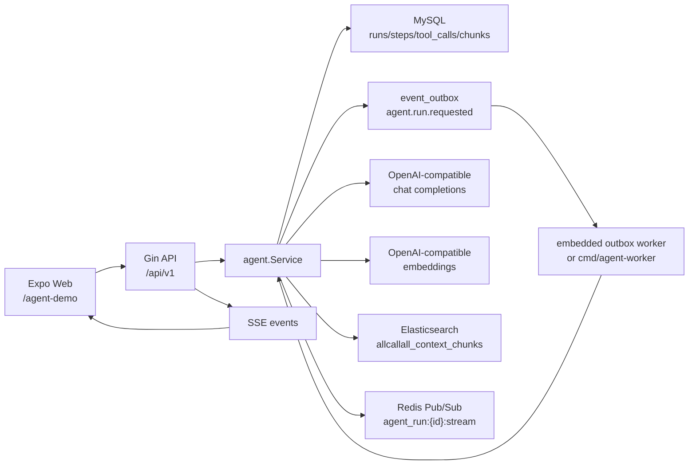

# AllCallAll Agent + ES Vector RAG 当前状态说明

更新时间：2026-06-18

本文完全从当前代码实现出发，说明 AllCallAll 现在在 Web 端 Agent、Agent 编排、工具调用、RAG、ES vector 检索、可演示能力和边界上的真实状态。它可以作为后续开发计划、面试复盘和本地调试手册的共同基准。

## 结论先行

当前项目最适合展示的方向是：**Web 端可调试的会话 AI Agent + ES dense_vector RAG**。

它已经不是只有后端概念的半成品。现在 Web 端可以进入 `Agent RAG Demo`，创建演示会话，写入消息和内部备注，提交 Agent run，并看到 Agent 输出、执行状态、trace timeline 和 RAG citation。后端已经具备 run/outbox/worker/step/tool_call/memory/RAG chunk/ES vector/SSE 的完整链路。

但它也还不是生产级 Agent 平台。真实 LLM 接入和 ES vector RAG 已经能跑通，仍缺少更强的工具 schema、审批 UI、可观测的向量命中解释、索引重试、评测集和多用户演示种子数据。多智能体目前是同步 `delegate_task` 子 run，不是独立长期运行的多 Agent 系统。

一句话定位：

> 这是一个可以本地演示和调试的 Agent 工程化项目，核心亮点是把会话系统里的消息、内部备注、会议 follow-up、联系人资料、转写片段和 Agent memory 做成可检索上下文，并通过 OpenAI-compatible planner + ES vector 检索生成有引用的协作建议。

## 当前可演示能力

| 模块 | 当前状态 | 真实能力 | 主要边界 |
| --- | --- | --- | --- |
| Web Agent Demo | 可演示 | 登录后默认进入 `AgentDemo`，可创建演示线程、查看上下文、Ask AI、展示 trace/citations | 需要登录态和当前 organization，不是免登录公开 demo |
| Agent run 生命周期 | 基本完整 | 创建 run、幂等键、pending/running/ready/failed/requires_action、lease、attempt、outbox worker 执行 | worker 可靠性和失败重放还偏本地开发级 |
| Agent 编排 | 可用 | `rules/mock_llm/openai_compatible` 三种 planner；OpenAI-compatible 走 ReAct 循环和工具调用 | ReAct 最多 5 轮；复杂恢复、长期任务、并发 agent 未实现 |
| 工具调用 | 可用骨架 | 8 个后端托管工具，含读上下文、写消息、创建 follow-up、写 memory、delegate task | tool schema 较粗；写工具默认无需人工审批 |
| RAG | 已可用 | 将消息、备注、memory、follow-up、联系人、转写片段写入 SQL chunk，并同步到 ES dense_vector | ingestion 是 run 时刷新；ES 写入异步 best-effort，无重试队列 |
| ES vector | 已接入 | `allcallall_context_chunks` 使用 `dense_vector`、`index=true`、`cosine`，查询用 `cosineSimilarity` | 不是 Milvus/Pinecone 这类专用向量库，但在本项目中承担向量数据库角色 |
| 引用/citation | 可展示 | 后端返回 `citations`，前端展示 evidence snippet 和 score | citation 还不能跳回原始消息/备注详情页 |
| SSE/trace | 可展示 | 前端通过 SSE 看 run/step/tool 事件，结果页也可从持久化 trace 回放 | token 级流式在当前 tool-calling 模式下基本不会触发 |

## 运行架构

本地 demo 的最小闭环是：



关键点：

- API server 在启动时初始化 Agent service、planner、chunk indexer、Redis stream publisher，并注册 Agent outbox handler。
- 如果 `EMBEDDED_WORKERS` 为空、`1`、`true` 或 `yes`，API 进程会内嵌 outbox worker，本地 Web demo 不一定需要另起 `agent-worker`。
- `cmd/agent-worker` 仍然存在，适合把 Agent 执行从 API 进程拆出去。
- `ELASTICSEARCH_URL` 存在时，API server 和 agent worker 都会初始化 `allcallall_context_chunks` vector index。

相关代码：

- `backend/cmd/server/main.go`：组装 Agent service、planner、chunk indexer、Redis stream、outbox worker。
- `backend/cmd/agent-worker/main.go`：独立 Agent worker 入口。
- `backend/internal/runtime/workers.go`：outbox 事件注册和 worker 配置。
- `backend/internal/runtime/integrations.go`：从环境变量选择 ES search service 和 chunk indexer。
- `backend/internal/runtime/redis_stream.go`：Agent token Pub/Sub channel。

## Web 端使用入口

当前 Web 端已经被临时调整成 Agent 展示优先：

- `mobile/src/navigation/AppNavigator.tsx` 中，登录后如果是 Web 平台，初始页是 `AgentDemo`。
- `mobile/src/screens/AgentDemoScreen.tsx` 提供演示工作台：
  - 列出 open conversations。
  - 创建 `Agent RAG Demo` 演示线程。
  - 自动写入两条客户消息和两条内部备注。
  - 输入 goal 并调用 `createAgentRun`。
  - 渲染 `AgentMessageBubble`。
- `mobile/src/screens/ConversationDetailScreen.tsx` 也有 `Ask AI`，可以在普通会话详情里直接提交 Agent run。
- `mobile/src/components/AgentMessageBubble.tsx` 展示：
  - run status。
  - timeline/trace。
  - summary 或 token buffer。
  - next step。
  - citations/evidence。

Web API 客户端在 `mobile/src/api/agent.ts`：

- `POST /api/v1/agent/runs` 创建 run。
- `GET /api/v1/agent/runs/:id` 获取 run、steps、tool_calls、trace、citations。
- `GET /api/v1/agent/runs/:id/events` 获取持久化推导事件。
- `GET /api/v1/agent/runs/:id/events/stream` 订阅 SSE。

注意：所有 Agent API 都是 protected route，需要 JWT，并且需要 `X-Organization-ID`。所以当前 demo 是“登录后的内部产品页”，不是公开 landing page。

## Agent 数据模型

Agent 相关核心表定义在 `backend/internal/models/commercial.go`：

- `agent_runs`：一次 Agent 执行。记录 org/user/conversation/source/role/status/goal/summary/action_items/next_step/risk_flags/error/attempts/lease timestamps。
- `agent_steps`：解释性步骤，例如 `collect_context`、`plan_next_actions`。
- `agent_tool_calls`：每次工具调用，包括 tool name、call id、input/output/error/status。
- `agent_memories`：会话级 Agent memory，目前主要写 `last_agent_summary`。
- `agent_context_chunks`：RAG 的 SQL 侧 chunk 存储，按 org/conversation/source_type/source_id 唯一。

`agent_runs.status` 当前使用：

- `pending`：已创建，等待 worker。
- `running`：已被 worker lease。
- `ready`：成功完成。
- `failed`：执行失败。
- `requires_action`：工具调用等待人工处理。后端路径存在，但当前工具默认不要求审批。

## Agent run 生命周期

### 1. 创建 run

入口是 `agent.Service.RunConversationAssistant`：

1. 空 goal 会默认成 `summarize_conversation_next_steps`。
2. 空 role 会默认成 `primary`。
3. 校验当前用户是否是 conversation member。
4. 如果有 `Idempotency-Key`，先查已有 run，避免重复创建。
5. 创建 `agent_runs`，source 使用当前 planner name。
6. 写 outbox 事件 `agent.run.requested`。
7. 返回初始 `RunResult`，其中包含 run/steps/tool_calls/trace/citations 的当前快照。

### 2. worker 执行

`agent.Service.ExecuteRun` 会：

1. 根据 run id 读取 run。
2. 如果 run 已 ready，直接返回结果。
3. 用数据库 update 抢占 lease，把 pending/可重试 failed/过期 running 改成 running。
4. `attempts + 1`，设置 `lease_until = now + 5 minutes`。
5. 根据 planner source 分流：
   - `openai_compatible`：走 ReAct loop。
   - 其他 provider：走 rules/mock 的确定性路径。
6. 成功后记录 metrics，并返回 `RunResult`。
7. 失败时把 run 标记为 `failed`，写 `error_message`，清掉 lease。

### 3. 输出结果

最终 `RunResult` 会包含：

- `run`：run 主记录和最终 summary/action items/next step/risk flags。
- `steps`：持久化步骤。
- `tool_calls`：上下文工具和写工具的调用记录。
- `trace`：由 run/steps/tool_calls 组装出的解释性 timeline。
- `citations`：从 `query_context_chunks` 工具输出中抽取的引用。

## Planner 与 Agent 编排

Planner 工厂在 `backend/internal/agent/provider.go`：

- `rules`：默认 planner，不调模型，基于会话状态、消息、备注、RAG chunk 生成确定性摘要和建议。
- `mock_llm`：模拟结构化 LLM 输出，用于不接真实模型时测试 JSON 输出链路。
- `openai_compatible`：真实 OpenAI-compatible chat completions 接入，支持 tool calling 和 embeddings。

### Prompt 结构

`BuildPlannerPrompt` 会构造：

- system prompt：根据 role 选择不同身份。
  - `primary`：主编排 Agent，可用 `delegate_task` 分配给 `translator/searcher/summarizer`。
  - `translator`：翻译 agent。
  - `searcher`：检索 agent。
  - `summarizer`：总结 agent。
- user prompt：包含 goal 和 JSON context。
- output schema：要求模型输出 `summary/action_items/next_step/risk_flags`。
- retrieved context chunks：直接进入 prompt context。

这意味着 RAG 不是只作为工具结果展示，而是会进入模型上下文，影响最终回答。

### ReAct 循环

OpenAI-compatible provider 会走 `executeReActRun`：

1. 加载 conversation context。
2. 刷新并检索 RAG chunks。
3. 先记录 baseline context tool calls，方便 trace/citation 展示。
4. 创建 `collect_context` step。
5. 进入最多 5 轮 ReAct loop。
6. 每轮调用 planner。
7. 如果 planner 返回 tool calls：
   - 校验工具是否存在。
   - 如果工具要求审批，run 改成 `requires_action`。
   - 否则在后端本地执行工具。
   - 把工具结果追加到 message history。
8. 如果 planner 不再返回 tool calls：
   - 创建 `plan_next_actions` step。
   - 标记 run ready。
9. 如果 5 轮后仍未结束，run 失败。

重要边界：当前 ReAct 工具调用会真实执行写工具，例如写 system message、创建 follow-up task、更新 memory。因此演示时应使用测试账号和测试 conversation。

### 多 Agent 现状

当前“多智能体”实现为 `delegate_task`：

- 主 Agent 可以让模型调用 `delegate_task`。
- 后端创建一个新的子 `AgentRun`。
- 子 run 使用目标 role，例如 `translator/searcher/summarizer`。
- 子 run 同步执行 `executeReActRun`。
- 父 run 收到子 run 的 `run_id/status/result_summary`。

这能展示“Agent 编排和角色分工”的代码骨架，但还不是生产级多 Agent：

- 子 Agent 不是独立 worker 并发执行。
- 没有 agent 间长期消息队列。
- 没有任务图/DAG。
- 没有复杂冲突合并或 planner arbitration。

## 工具系统

工具注册在 `backend/internal/agent/tool_registry.go`。当前共有 8 个工具。

读工具：

- `query_recent_meetings`：读取会话关联的近期会议。
- `query_conversation_members`：读取会话成员和 peer user ids。
- `query_contact_profile`：读取联系人画像。
- `query_context_chunks`：读取 RAG context chunks。

写工具：

- `write_conversation_message`：把 Agent 结果写回会话系统消息，并发 outbox。
- `create_follow_up_task`：根据 next step 创建 follow-up task。
- `upsert_agent_memory`：写入会话级 memory。
- `delegate_task`：创建并执行子 Agent run。

工具调用记录会进入 `agent_tool_calls`，并被 trace 和 SSE events 消费。读工具主要用于可解释性和 citation；写工具会产生业务副作用。

当前边界：

- `buildJsonSchema` 只是把内部 `map[string]string` 粗略转成 OpenAI function schema，数组类型目前简化成 `array<string>`。
- `query_context_chunks` 的工具 description 文字仍写着 SQL-ranked，但真实实现已经是 ES vector 优先、SQL 关键词 fallback。
- 所有工具目前 `RequiresApproval` 默认 false，虽然 `SubmitToolOutputs` 后端路径已经存在，Web 端还没有完整审批 UI。

## RAG 实现细节

### RAG 数据来源

`refreshConversationContextChunks` 会把以下业务数据变成 context chunks：

- `note`：conversation internal notes。
- `message`：conversation messages。
- `memory`：Agent memory。
- `followup`：call follow-up summary/action/risk/draft。
- `contact_profile`：联系人画像。
- `transcript`：会议转写片段。

这比“只检索聊天消息”的 RAG 更完整，适合讲成“业务上下文 RAG”。

### SQL chunk 存储

`agent_context_chunks` 是 RAG 的主记录表：

- 每个 chunk 由 `organization_id + conversation_id + source_type + source_id` 唯一确定。
- 保存 `content`、`keywords`、`last_run_id`、timestamps。
- 通过 upsert 刷新，所以同一个业务源不会反复创建重复 chunk。

SQL 表目前不存 embedding 向量。向量只写入 ES document 的 `content_vector` 字段。

### Embedding 生成

如果当前 planner 实现了 `EmbeddingProvider`，`upsertContextChunk` 会调用 `CreateEmbedding(ctx, content)`：

- 成功：拿到 `[]float32`，写入 ES 文档。
- 失败：不阻断 run，SQL chunk 仍然会写入。

`openai_compatible` planner 实现了 embedding：

- embedding base URL/API key/model 可以单独配置。
- 如果没配置 embedding base/key，会 fallback 到 chat base/key。
- 默认 embedding model 是 `text-embedding-3-small`。

### ES vector index

`backend/internal/search/elasticsearch.go` 中的 `InitChunkIndex` 创建：

- index：`allcallall_context_chunks`
- field：`content_vector`
- type：`dense_vector`
- dims：来自 `AGENT_OPENAI_EMBEDDING_DIMS`，默认 1536
- index：true
- similarity：cosine

搜索时使用：

```text
script_score:
  cosineSimilarity(params.query_vector, 'content_vector') + 1.0
filter:
  organization_id
  conversation_id
```

所以 ES 在当前项目中确实承担了“向量数据库/向量检索引擎”的角色。它不是专用向量数据库产品，但 ES 的 dense_vector capability 对当前 demo 已足够。

### 检索流程

`retrieveConversationContextChunks` 的真实逻辑是：

1. 从 SQL 读取当前 conversation 最近 100 个 chunks。
2. query = goal + conversation title + status + priority。
3. 如果配置了 ES indexer，并且 planner 能生成 embedding：
   - 对 query 生成 query embedding。
   - 调用 ES `SearchChunks`。
   - 如果 ES 返回非空结果，直接使用 ES vector 结果。
4. 如果 ES 不可用、embedding 失败、搜索报错或结果为空：
   - fallback 到 SQL keyword matching。
   - 英文按词，中文按 2-4 字 ngram。
   - memory/followup/contact_profile 有轻微加权。
5. 返回 top K，默认 8 条。

这个设计让 demo 更稳：ES 或 embedding 出问题时不会直接崩，但也带来一个边界：当前结果中没有明确标注“这次命中了 vector 还是 SQL fallback”。

### Citation

后端 citation 从 `query_context_chunks` 工具输出构建：

- `source_type`
- `source_id`
- `title`
- `snippet`
- `score`
- `created_at`

前端如果后端没有直接返回 citations，也会从 `query_context_chunks` 的 tool output 兜底抽取。当前 citations 能作为 evidence 展示，但还不能点击跳转回原始业务对象。

## SSE 与 trace

Agent 的实时展示分两层：

1. 持久化事件：`BuildRunEvents` 从 run/steps/tool_calls 推导出：
   - `run_queued`
   - `run_started`
   - `step_started`
   - `step_done`
   - `tool_called`
   - `tool_done`
   - `run_ready`
   - `run_failed`
2. SSE endpoint：`/agent/runs/:id/events/stream`
   - 每 500ms 拉取一次 persisted events。
   - 有 Redis 时订阅 `agent_run:{runID}:stream`，可以发送 `token` event。
   - terminal event 后结束。
   - 超时发送 `stream_timeout`。

当前 token 级流式的边界很明确：OpenAI-compatible planner 总是给 prompt 加 tools；而 chat completions 代码只有在没有 tools 时才设置 `stream=true`。所以在当前 ReAct/tool-calling 路径下，Web 端更多看到的是 run/step/tool 事件流，而不是逐 token 文本流。

## 配置要求

本地 Web + ES vector RAG demo 至少需要：

```bash
AGENT_PROVIDER=openai_compatible

AGENT_OPENAI_BASE_URL=...
AGENT_OPENAI_API_KEY=...
AGENT_OPENAI_MODEL=...

AGENT_OPENAI_EMBEDDING_BASE_URL=...
AGENT_OPENAI_EMBEDDING_API_KEY=...
AGENT_OPENAI_EMBEDDING_MODEL=...
AGENT_OPENAI_EMBEDDING_DIMS=1024

ELASTICSEARCH_URL=http://127.0.0.1:9200

DB_DSN=...
REDIS_ADDR=...
REDIS_PASSWORD=...
JWT_SECRET=...
```

配置说明：

- `AGENT_OPENAI_EMBEDDING_DIMS` 必须和 embedding 模型输出维度一致。比如 BAAI/bge-m3 通常是 1024。
- `ELASTICSEARCH_URL` 配置后，API server 启动会尝试初始化 `allcallall_context_chunks`。如果 ES 不可访问，当前代码会 fatal，适合 demo 前快速暴露配置问题。
- `backend/.env.example` 已给出本地配置模板；`backend/.env` 可能包含真实 key 和密码，不能提交。
- 如果只想用规则 fallback，可用 `AGENT_PROVIDER=rules`，但这时没有真实 LLM tool calling，也没有 embedding provider，RAG 会退到 SQL keyword retrieval。

## 已验证的 demo 链路

当前阶段已经跑通过以下类型验证：

- 后端 Go 测试：Agent、search、handlers 等相关包通过。
- 移动/Web TypeScript 类型检查通过。
- Expo Web smoke 可以打开 `/agent-demo`。
- ES index mapping 中 `allcallall_context_chunks.content_vector` 是 `dense_vector`，dims 与配置一致。
- 真实 embedding probe 返回 1024 维向量。
- 真实 HTTP Agent RAG smoke 能完成 run，并产生：
  - `run_status=ready`
  - planner source `openai_compatible`
  - steps
  - tool_calls
  - `query_context_chunks`
  - citations
  - SQL chunks
  - ES docs

后续每次改 Agent/RAG 代码，建议至少跑：

```bash
cd backend && go test ./internal/agent ./internal/search ./internal/handlers
cd mobile && npx tsc --noEmit
```

如果改到真实 demo 链路，再加：

```bash
curl http://127.0.0.1:8080/api/v1/health
curl http://127.0.0.1:9200/allcallall_context_chunks/_mapping
```

## 当前能力边界

### 1. RAG 是可用的，但还不是成熟知识库系统

已经实现：

- 多业务源 chunk 化。
- SQL chunk 主记录。
- embedding 生成。
- ES dense_vector index。
- vector-first retrieval。
- SQL keyword fallback。
- citation 输出。

尚未实现：

- 文件/网页/外部知识库 ingestion。
- chunk 分段策略、去重策略、版本策略的系统化设计。
- chunk indexing retry/dead-letter。
- 检索结果中标明 vector/fallback 来源。
- citation 点击回源。
- RAG 质量评测集。

### 2. Agent 编排能展示 ReAct，但不是完整自治 Agent 平台

已经实现：

- ReAct loop。
- tool calling。
- message history。
- tool result 回灌。
- delegate sub-run。
- run/step/tool trace。
- requires_action 后端状态和 submit API。

尚未实现：

- 并行多 Agent。
- 长任务调度和任务图。
- agent 间消息协议。
- 人工审批前端。
- 工具权限的细粒度策略。
- tool schema 的严格 JSON Schema。
- planner 行为 eval 和回归数据集。

### 3. Web demo 已经能给人调试，但不是产品化控制台

已经实现：

- Web 默认进入 AgentDemo。
- 一键创建演示线程。
- Ask AI。
- 结果展示。
- timeline 展示。
- evidence 展示。

尚未实现：

- 免登录 demo。
- demo seed account/seed org 自动化。
- trace inspector 详情页。
- tool input/output 展开查看。
- requires_action 审批 UI。
- citation 回源跳转。
- 失败 run 的重试按钮。

### 4. 生产可靠性还需要补

已经实现：

- outbox。
- lease。
- attempts。
- embedded worker。
- standalone agent worker。
- Redis stream publisher。

尚未实现：

- chunk ES 写入失败的重试。
- 更完整的 worker dashboard。
- provider timeout/retry/backoff 策略。
- LLM 成本统计。
- prompt/version 管理。
- 安全审计和工具执行白名单策略的产品化展示。

## 建议下一步推进

为了贴合 “AI Agent 工程化 + RAG + 开发工具链/研发平台实践” 方向，建议按下面顺序继续：

1. **把 RAG 可观测性补齐**
   - 在 `query_context_chunks` 输出里增加 `retrieval_mode=vector|sql_fallback`。
   - 展示 embedding dims、ES score、SQL fallback reason。
   - Web evidence 区支持展开原始 chunk metadata。

2. **把 Web demo 调试能力做完整**
   - AgentMessageBubble 展开 tool input/output。
   - citation 点击跳到消息/备注/联系人/转写详情。
   - 失败 run 支持 retry。
   - 做一个 demo seed 脚本，一键创建用户、组织、会话、备注、联系人资料。

3. **补强 ReAct tool schema 和审批**
   - 将工具 schema 改成更严格的 JSON Schema。
   - 对写工具开启 `RequiresApproval` 的可配置开关。
   - Web 增加 approve/reject UI。

4. **补 RAG/Agent 测试故事**
   - fake OpenAI-compatible server 覆盖 tool_call、delegate_task、max iteration、fallback。
   - RAG 检索测试覆盖 vector hit、embedding failure fallback、ES empty fallback。
   - 保留一组固定业务样本，用于面试时展示“如何防止 prompt/工具改动退化”。

5. **把项目叙述收束成一句主线**
   - 不建议当前阶段主讲多人通话。
   - 建议主讲：`Web-based collaboration Agent with ES vector RAG, tool orchestration, traceable runs, and conversation-grounded citations`。
   - 多人通话和会议数据可以作为 Agent 的业务上下文来源，而不是主卖点。

## 面试表达建议

可以这样描述项目：

> 我在 AllCallAll 中把协作会话系统升级成了一个可调试的 Web Agent Demo。后端实现了 Agent run 生命周期、outbox worker、ReAct tool calling、Agent memory、trace timeline 和 SSE；RAG 部分把消息、内部备注、会议 follow-up、联系人画像、转写片段统一成 context chunks，使用 OpenAI-compatible embedding 写入 Elasticsearch dense_vector，查询时优先向量检索，失败时退回 SQL keyword matching，并在前端展示 citations。当前多 Agent 是通过 delegate_task 创建子 run 的同步编排，已经能展示角色分工，但还没有做到并发自治 Agent。下一步我会补 RAG 可观测性、审批 UI、严格工具 schema 和 eval 测试集。

