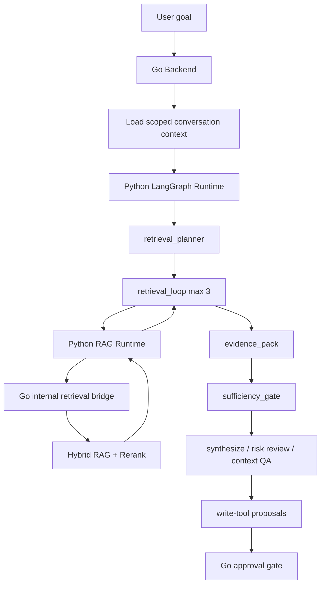

# Bounded Agentic RAG

AllCallAll is a good fit for Agentic RAG because the core product data is already scoped by organization, conversation, meeting recording transcript, knowledge source, contact profile, and follow-up history. The project should not use an open-ended autonomous Agent. The implemented direction is a bounded retrieval loop controlled by the Python LangGraph runtime, with Go remaining the source of truth for permissions, data access, approvals, audit, and writes.

## Architecture

The Python runtime can plan retrieval and call read-only tools, but it cannot read the database directly and cannot execute write tools. Write operations such as conversation write-back, follow-up creation, and Agent memory upsert are returned as proposals and must pass Go-owned approval handling.

## Runtime Behavior

- `retrieval_planner` creates a small deterministic retrieval plan from the workflow preset and user goal.
- `retrieval_loop` executes at most three read-only retrieval steps, observes hit quality, and refines the next query when evidence coverage is below threshold.
- `evidence_pack` keeps the final selected citations, snippets, source types, rejected count, and confidence.
- RAG Runtime responses can expose raw hits, reranked hits, rejected chunks, retrieval route, attempts, evidence pack, and grounding result for Agent Lab inspection.
- `sufficiency_gate` blocks unsupported synthesis from producing side-effect proposals when evidence is missing.
- Existing BM25/vector/RRF/rerank remains the Go-owned retriever and source-of-truth data path. The Python RAG Runtime controls retrieval strategy above that layer rather than replacing it.
- Qdrant is available as an optional vector-store adapter for fixture/eval and specialized experiments; it is not the default production source of truth.

## Tool Boundary

Read tools exposed through the Go bridge:

- `query_context_chunks`
- `query_knowledge_chunks`
- `query_meeting_transcript_segments`
- `query_contact_profile`
- `query_recent_followups`
- `query_recent_meetings`

Write tools remain approval-only:

- `write_conversation_message`
- `create_follow_up_task`
- `upsert_agent_memory`

## Configuration

- `PY_AGENT_ENABLE_AGENTIC_RAG=false`: default off for conservative Beta behavior.
- `PY_AGENT_RAG_MAX_RETRIEVAL_STEPS=3`: hard cap for bounded retrieval.
- `PY_AGENT_RAG_MIN_CONFIDENCE=0.6`: confidence threshold before stopping refinement.
- `AGENT_RUNTIME=python_langgraph`: Compose/Beta demo routes ReAct and supported workflow presets to the Python runtime.
- `PY_RAG_RUNTIME_BASE_URL=http://rag-runtime:8091`: enables the Agent runtime to delegate retrieval planning/rerank/grounding to the RAG microservice.
- `PY_RAG_TOOL_BRIDGE_BASE_URL` and `PY_RAG_TOOL_BRIDGE_TOKEN`: let the RAG Runtime call Go's internal authorized retrieval bridge.
- `PY_RAG_VECTOR_STORE=none|qdrant`, `PY_RAG_QDRANT_URL`, `PY_RAG_QDRANT_COLLECTION`: optional Qdrant adapter for vector/payload retrieval experiments.

## Eval Positioning

Agentic RAG is evaluated as task behavior, not as a fake large-scale benchmark. The Python eval runner now reports:

- `task_success_rate`
- `tool_intent_match_rate`
- `approval_safety_rate`
- `citation_grounding_rate`
- `retrieval_refinement_success_rate`
- `citation_coverage_rate`
- `max_iteration_compliance_rate`
- `unnecessary_tool_call_rate`
- RAG portfolio metrics in the external runtime include rerank top-match, route match, graph expansion, grounding pass, sufficiency pass, and retrieval refinement success.

The fixture set includes a multi-hop meeting recap case that requires meeting transcript evidence plus knowledge-base evidence. These numbers are deterministic regression evidence for the current fixture set, not claims about open-domain production quality.

## Interview Explanation

The concise explanation is:

> I used bounded Agentic RAG because a meeting recap or risk review often needs more than a single Top-K retrieval. The Agent first plans source-specific retrieval, calls only Go-authorized read tools, observes evidence coverage, refines within a hard iteration limit, builds an evidence pack, and runs a sufficiency check. If evidence is missing, it gives a conservative answer and suppresses write proposals. Go still owns permissions, approvals, audit, and all side effects.
