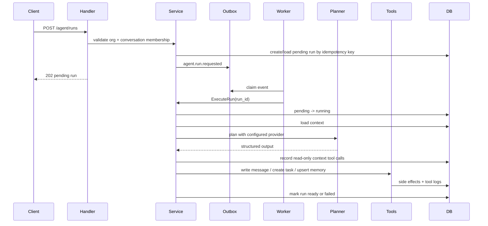

# AI Agent Design Notes

AllCallAll has two Agent execution styles:

- **ReAct-style single Agent** through `/api/v1/agent/runs`, used for quick conversation questions, summaries, risks, follow-ups, and write-back.
- **Workflow/DAG Agent** through `/api/v1/agent/workflows`, used for Agent Lab style task graphs, decomposition, tool policies, and human approvals.

The default provider is deterministic `rules`, so tests and demos do not require model credentials. `mock_llm` exercises prompt construction and structured JSON parsing without network calls. `openai_compatible` is the live-provider seam.

## ReAct Run Scope

A run analyzes one organization-scoped conversation and can produce:

- Summary.
- Action items.
- Next step.
- Risk flags.
- System message written back to the conversation.
- Follow-up task.
- Scoped memory for future runs.

API:

- `POST /api/v1/agent/runs`
- `GET /api/v1/agent/runs/:id`
- `GET /api/v1/agent/runs/:id/events`
- `GET /api/v1/agent/runs/:id/events/stream`

Required:

- JWT authentication.
- `X-Organization-ID`.
- Membership in the target conversation.
- Optional `Idempotency-Key` for retry-safe execution.

## Execution Flow



## Context Sources

`loadConversationContext` gathers:

- Conversation metadata, status, priority, assignee, contact binding.
- Recent messages.
- Internal notes.
- Recent rooms.
- Conversation members.
- Scoped Agent memories.
- Contact profile when bound.
- Call follow-ups and `call_transcript_segments` for older 1:1 call context.
- `meeting_transcript_segments` from recording-end meeting transcription.
- RAG context chunks from conversation artifacts and knowledge sources.

Meeting transcript segments are separate from call transcript segments. Retrieved references use `meeting_transcript` so citations can distinguish "meeting recording transcription" from older "call subtitles".

## Recording Transcription Integration

Recording stop can enqueue `recording.transcription.requested` when:

```bash
TRANSCRIPTION_ENABLED=true
TRANSCRIPTION_PROVIDER=mock
```

The outbox worker calls the provider for locally readable audio files and writes `meeting_transcript_segments`. The Agent prioritizes the latest recording session so it can answer questions such as "what did we just discuss in the meeting?" after the recording is processed.

Failure behavior:

- No conversation binding: transcription job is `skipped`.
- No audio file: `skipped`.
- S3-only/unreadable storage in v1: `failed`.
- Provider error: `failed`.
- Recording persistence still succeeds even if transcription later fails.

## Tools

Tool descriptors live in `backend/internal/agent/tool_registry.go`. Important tools:

- `query_recent_meetings`
- `query_conversation_members`
- `query_contact_profile`
- `query_context_chunks`
- `write_conversation_message`
- `create_follow_up_task`
- `upsert_agent_memory`

Read-only context tools are persisted as `agent_tool_calls` for auditability. Mutating tools are backend-owned: the planner proposes intent, and service code performs permission checks, transactions, idempotency, metrics, and outbox writes.

## Workflow Agent / Agent Lab

Workflow endpoints:

- `POST /api/v1/agent/workflows`
- `GET /api/v1/agent/workflows`
- `GET /api/v1/agent/workflows/:id`
- `POST /api/v1/agent/workflows/:id/process`
- `GET /api/v1/agent/approvals`
- `POST /api/v1/agent/approvals/:id/decision`

Models:

- `workflow_runs`
- `workflow_tasks`
- `workflow_history_events`
- `workflow_signals`
- `workflow_timers`
- `agent_messages`
- `tool_policies`
- `tool_approvals`

This path is for DAG-style decomposition and human approval. Approval statuses include `pending`, `approved`, `rejected`, `executed`, and `failed`.

### Bounded ReAct Inside Role Tasks

The Workflow Agent now combines DAG control with bounded role-level ReAct:

- `searcher` runs a read-only ReAct loop with `max_iterations=3` and can call `query_context_chunks`.
- `risk_analyst` runs a read-only ReAct loop with `max_iterations=2` and can call `query_context_chunks` plus `query_recent_meetings`.
- `summarizer` stays as direct synthesis for stability.

Each role iteration records a plan and observation in `agent_messages`, and the task output includes `react_trace`. Only read-only tools are allowed inside role ReAct. Side-effect tools such as `write_conversation_message`, `create_follow_up_task`, and `upsert_agent_memory` still enter the `propose_tools -> approval -> commit_result` path.

## Trace And Events

Agent API responses include a derived trace from persisted rows, not a separate trace table:

- `agent_runs`
- `agent_steps`
- `agent_tool_calls`

Run events:

- `run_queued`
- `run_started`
- `step_started`
- `step_done`
- `tool_called`
- `tool_done`
- `run_ready`
- `run_failed`

`events/stream` uses SSE over persisted rows, so clients can reconnect or fall back to polling.

## Provider Seam

```bash
AGENT_PROVIDER=rules
AGENT_PROVIDER=mock_llm
AGENT_PROVIDER=openai_compatible
AGENT_OPENAI_BASE_URL=https://api.example.com/v1
AGENT_OPENAI_MODEL=example-model
AGENT_OPENAI_API_KEY=...
```

`openai_compatible` falls back to `rules` when unavailable and records fallback metrics. Tool execution remains backend-mediated; the model never mutates application state directly.

## RAG And Knowledge

Conversation context chunks and knowledge chunks provide the retrieval layer:

- Conversation messages, notes, memories, call transcripts, meeting transcripts, and follow-ups become retrievable chunks.
- Knowledge sources support text/URL/file import, grouping, duplicates, canonical version selection, dead letters, and reingest.
- Elasticsearch can back chunk/message indexing where configured.
- Retrieval remains permission-scoped through organization and conversation membership.

## Idempotency And Safety

- `POST /agent/runs` accepts `Idempotency-Key`.
- Outbox events use idempotency keys such as `agent.run.requested:<run_id>`.
- Replaying a completed run does not repeat side effects.
- Mutating tools write visible system messages/tasks/memory rather than silently editing conversation state.
- The Agent does not read secrets, raw tokens, private keys, or unbounded raw audio.

## Eval Harness

```bash
make agent-eval
make rag-eval
make workflow-eval
make agent-demo-report
```

The eval harnesses run deterministic planner, RAG, and workflow cases without external credentials. Workflow eval includes a meeting recap case that verifies bounded role ReAct retrieves `meeting_transcript` citations while read tools bypass human approval and write tools still require it.
