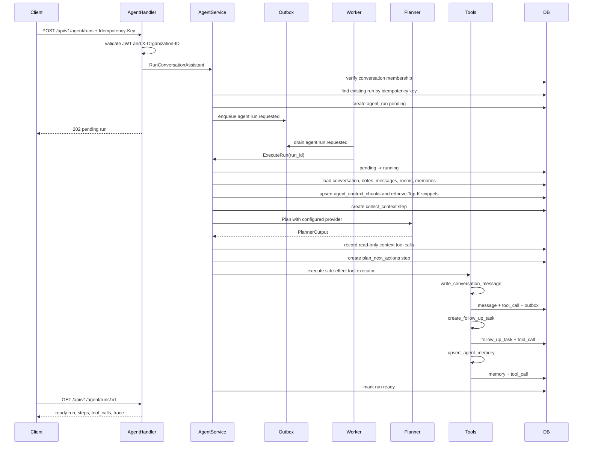

# AI Agent Design Notes

The current Agent is intentionally deterministic and rules-based by default. This keeps tests stable and makes the project easy to demo without API keys. The backend also includes a `mock_llm` provider that exercises prompt/JSON-output parsing without a network call, plus an OpenAI-compatible provider seam for a future real model.

## Current Scope

The Agent analyzes an organization-scoped collaboration thread and produces:

- A summary.
- Action items.
- A next step.
- Risk flags.
- A system message written back to the conversation.
- A follow-up task.
- A scoped memory entry for future runs.

Supported API:

- `POST /api/v1/agent/runs`
- `GET /api/v1/agent/runs/:id`
- `GET /api/v1/agent/runs/:id/events`
- `GET /api/v1/agent/runs/:id/events/stream`

Both APIs require:

- JWT authentication.
- `X-Organization-ID`.
- Membership in the target conversation.
- Optional `Idempotency-Key` for retry-safe execution.

## Data Model

- `agent_runs`: one execution record per Agent request.
- `agent_steps`: explainable intermediate stages, such as context collection and next-action planning.
- `agent_tool_calls`: side-effect records with input/output JSON and status.
- `agent_memories`: scoped memory entries, currently `last_agent_summary` per organization/user/conversation.
- `agent_context_chunks`: lightweight RAG-style snippets indexed from conversation notes, messages, and scoped memories.
- `event_outbox`: durable domain events emitted by Agent tools.

Source enum:

- `rules`: deterministic v1 implementation.
- `mock_llm`: deterministic mock LLM-style provider that builds and parses structured JSON output.
- `openai_compatible`: reserved provider seam for future model integration.

Run status:

- `pending`
- `running`
- `ready`
- `failed`

## Execution Flow



## Tool Calls

Current tools are documented in `backend/internal/agent/tool_registry.go`. Each descriptor includes name, kind, permission, input schema, output schema, and idempotency key template for mutating tools.

- `query_recent_meetings`: records recent room/meeting context for the conversation.
- `query_conversation_members`: records member/peer context for bounded planning.
- `query_contact_profile`: records bound business-contact context when a conversation has `contact_id`.
- `query_context_chunks`: records RAG-lite Top-K context snippets from notes, messages, and scoped memories.
- `write_conversation_message`: writes a system message into the collaboration thread and enqueues an outbox event.
- `create_follow_up_task`: creates a lightweight follow-up task from the planned next step.
- `upsert_agent_memory`: stores the latest scoped Agent summary for future context.

Read-only context tools are still persisted as `agent_tool_calls` so the run is auditable, but they do not mutate business state. Mutating tools write their own `agent_tool_calls` rows with input/output JSON and status.

Tool execution remains backend-owned. The planner proposes structured output; the service decides whether and how to mutate data.

Implementation boundary:

- `executeRulesRun` owns run state, context collection, prompt construction, provider fallback, planner metrics, and final run persistence.
- `recordContextToolCalls` owns read-only context tool records.
- `executeSideEffectTools` owns ordered mutating tool execution and tool metrics for `write_conversation_message`, `create_follow_up_task`, and `upsert_agent_memory`.
- Each mutating tool keeps its own transaction and output JSON, which makes tool failures inspectable without letting the planner directly mutate application state.

## Trace Timeline

Agent API responses include a derived `trace` array built from persisted run, step, and tool-call rows. It is intentionally not a new table. The trace is a presentation layer that lets interviews and support flows inspect:

- `agent.run.created`
- `agent.run.started`
- execution steps such as `collect_context` and `plan_next_actions`
- tool calls with registry metadata such as `kind` and `permission`
- terminal events such as `agent.run.ready` or `agent.run.failed`

See [Agent Trace Example](agent-trace-example.md) for a concrete response.

## Streaming-Style Run Events

`GET /api/v1/agent/runs/:id/events` exposes the same persisted execution as a polling-friendly event timeline.

`GET /api/v1/agent/runs/:id/events/stream` exposes the same event model over Server-Sent Events. The stream emits already-persisted events immediately, polls for newly persisted rows, and closes after `run_ready` or `run_failed`. It is intentionally backed by `agent_runs`, `agent_steps`, and `agent_tool_calls` instead of an in-memory trace buffer, so reconnects can fall back to the polling endpoint without losing explainability data.

Current event names:

- `run_queued`
- `run_started`
- `step_started`
- `step_done`
- `tool_called`
- `tool_done`
- `run_ready`
- `run_failed`

Each event includes `sequence`, `event`, `status`, `ref_type`, `ref_id`, `name`, `at`, and optional metadata. Tool events include registry metadata such as tool `kind` and `permission`, so an interviewer can see the boundary between read-only context gathering and mutating tool execution.

## Idempotency And Side Effects

`POST /api/v1/agent/runs` accepts `Idempotency-Key`. When the same user, organization, conversation, and key are seen again, the service returns the existing run result instead of creating a new run. That prevents duplicate pending jobs and later duplicate conversation messages, follow-up tasks, memories, and outbox events during client retries.

The outbox writes have their own idempotency keys: `agent.run.requested:<run_id>` and `agent.run.completed:<run_id>`. This gives two layers of retry safety: the Agent run is retry-safe at the API boundary, and durable domain events are retry-safe at the outbox boundary. `ExecuteRun` is also status-guarded, so replaying the same requested event after completion returns the persisted run instead of repeating tool side effects.

## Memory Model

`agent_memories` is scoped by organization, user, conversation, and key. The current key is `last_agent_summary`, and the value stores summary, action items, next step, and risk flags. The memory is inspectable in tests and is loaded into future planner input, but it is not a cross-user global memory and it does not store secrets or raw media.

## RAG-Lite Context Retrieval

The first retrieval layer is deliberately simple and deterministic:

- Index source rows into `agent_context_chunks`: conversation notes, text/system messages, and scoped Agent memories.
- Extract lightweight keywords from chunk content.
- Score chunks against the Agent goal plus conversation title/status/priority.
- Return a bounded Top-K list to the planner and persist the retrieval as `query_context_chunks`.

This is not embedding search yet. The point is to demonstrate the backend shape of RAG: chunking, retrieval, source attribution, Top-K limits, permission boundaries, and auditable tool calls. An embedding provider can be added behind the same table and tool boundary later.

## Eval Harness

The deterministic eval harness lives in `backend/internal/agent/eval.go` and `backend/cmd/agent-eval`.

```bash
make agent-eval
```

It loads fixture cases from `backend/internal/agent/testdata/eval_cases.json`, runs the selected provider, and validates:

- non-empty summary and next step
- minimum action item count
- required summary and next-step substrings
- required and forbidden risk flags
- prompt token estimates for prompting providers

This keeps Agent behavior regression-testable without external LLM credentials. Use `AGENT_PROVIDER=mock_llm make agent-eval` to exercise prompt construction and structured JSON parsing without network calls.

## Outbox Worker

Agent run creation enqueues `agent.run.requested` into `event_outbox`. The server starts a lightweight worker that drains pending rows, calls `ExecuteRun`, and later observes `agent.run.completed`. Conversation message creation also writes `message.created`, so chat and Agent side effects share the same durable event path.

Worker controls:

- `OUTBOX_WORKER_INTERVAL_SEC`
- `OUTBOX_WORKER_BATCH_SIZE`
- `OUTBOX_WORKER_MAX_ATTEMPTS`
- `OUTBOX_WORKER_RETRY_DELAY_SEC`

Worker metrics:

- `outbox_publish_total`
- `outbox_publish_retry_total`
- `outbox_publish_failed_total`
- `agent_run_queued_total`
- `agent_run_started_total`
- `agent_run_total`
- `agent_run_failed_total`
- `agent_planner_latency_ms_total`
- `agent_planner_token_estimate_total`
- `agent_planner_fallback_total`

## Provider Seam

The project exposes a planner interface:

```go
type Planner interface {
    Name() string
    Plan(ctx context.Context, input PlannerInput) (PlannerOutput, error)
}
```

Current implementations:

- `RulesPlanner`: default deterministic provider.
- `MockLLMPlanner`: deterministic mock model provider that builds a prompt, estimates prompt tokens, returns structured JSON, and parses it back into `PlannerOutput`.
- `OpenAICompatiblePlanner`: configurable Chat Completions-compatible provider that sends the same prompt/schema contract and parses JSON into `PlannerOutput`.

Tool calling is still mediated by backend code, not executed directly by the model. The model proposes a bounded plan; the service owns permission checks, idempotency, message write-back, task creation, and memory updates.

Provider selection:

```bash
AGENT_PROVIDER=rules
AGENT_PROVIDER=mock_llm
AGENT_PROVIDER=openai_compatible
AGENT_OPENAI_BASE_URL=https://api.example.com/v1
AGENT_OPENAI_MODEL=example-model
AGENT_OPENAI_API_KEY=...
AGENT_OPENAI_TIMEOUT_MS=10000
AGENT_OPENAI_MAX_TOKENS=600
```

`rules` is the default. `mock_llm` is useful for interviews because it demonstrates prompt construction and structured-output parsing without requiring credentials. `openai_compatible` makes a real HTTP call only when `AGENT_OPENAI_BASE_URL` and `AGENT_OPENAI_MODEL` are configured; otherwise service execution falls back to `rules` and increments `agent_planner_fallback_total`.

## Why This Is Useful In Interviews

This module shows backend fundamentals that map well to modern AI Agent systems:

- State machine persistence instead of one-shot request handling.
- Tool invocation as first-class data, not hidden side effects.
- Permission checks before tool execution.
- Idempotency key support to avoid repeated side effects on retry.
- Scoped memory that can be inspected and tested.
- Outbox event persistence for async delivery.
- Deterministic tests for Agent behavior.
- Metrics for run success, failures, memory writes, tool calls, planner latency, prompt token estimates, and provider fallback.

## Safety Boundaries

- The Agent can only access conversations where the caller is a member.
- The Agent writes a system message instead of silently changing conversation status or assignee.
- The Agent does not call external providers in v1.
- The Agent does not read or store secrets, tokens, raw audio, or private keys.
- Repeated client retries can use `Idempotency-Key` to avoid duplicate tool side effects.
