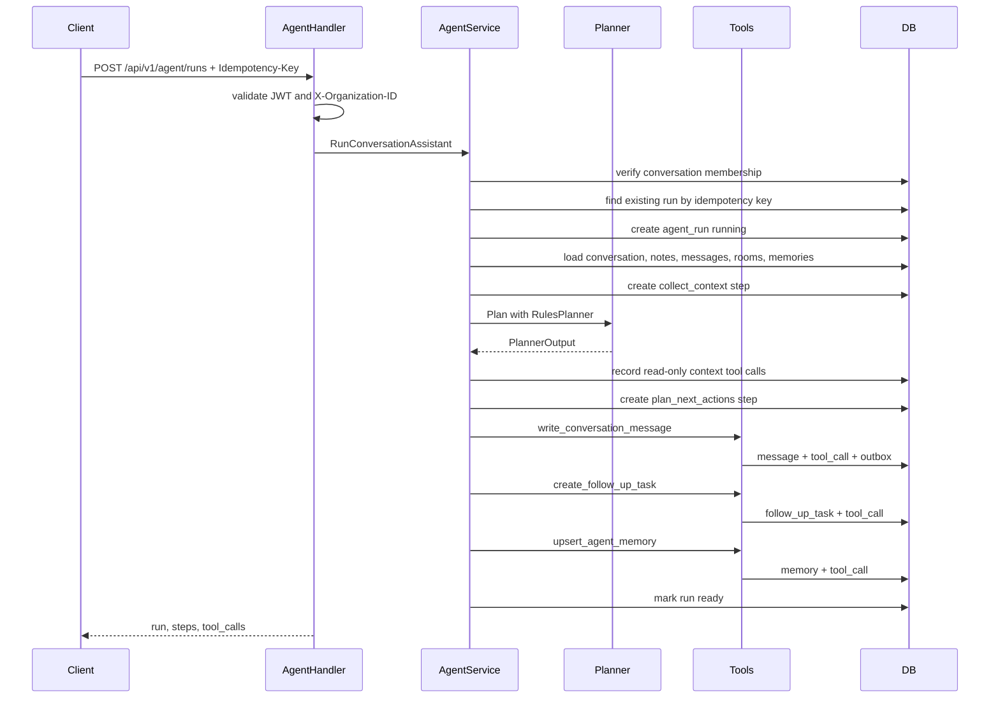

# AI Agent Design Notes

The current Agent is intentionally deterministic and rules-based. This keeps tests stable and makes the project easy to demo without API keys. The backend is structured so an OpenAI-compatible provider can be added later without changing the HTTP API or tool execution model.

## Current Scope

The Agent analyzes an organization-scoped collaboration thread and produces:

- A summary.
- Action items.
- A next step.
- Risk flags.
- A system message written back to the conversation.
- A follow-up task.
- A scoped memory entry for future runs.

Supported API:

- `POST /api/v1/agent/runs`
- `GET /api/v1/agent/runs/:id`

Both APIs require:

- JWT authentication.
- `X-Organization-ID`.
- Membership in the target conversation.
- Optional `Idempotency-Key` for retry-safe execution.

## Data Model

- `agent_runs`: one execution record per Agent request.
- `agent_steps`: explainable intermediate stages, such as context collection and next-action planning.
- `agent_tool_calls`: side-effect records with input/output JSON and status.
- `agent_memories`: scoped memory entries, currently `last_agent_summary` per organization/user/conversation.
- `event_outbox`: durable domain events emitted by Agent tools.

Source enum:

- `rules`: deterministic v1 implementation.
- `openai_compatible`: reserved provider seam for future model integration.

Run status:

- `pending`
- `running`
- `ready`
- `failed`

## Execution Flow



## Tool Calls

Current tools:

- `query_recent_meetings`: records recent room/meeting context for the conversation.
- `query_conversation_members`: records member/peer context for bounded planning.
- `query_contact_profile`: records bound business-contact context when a conversation has `contact_id`.
- `write_conversation_message`: writes a system message into the collaboration thread and enqueues an outbox event.
- `create_follow_up_task`: creates a lightweight follow-up task from the planned next step.
- `upsert_agent_memory`: stores the latest scoped Agent summary for future context.

Read-only context tools are still persisted as `agent_tool_calls` so the run is auditable, but they do not mutate business state. Mutating tools write their own `agent_tool_calls` rows with input/output JSON and status.

Tool execution remains backend-owned. The planner proposes structured output; the service decides whether and how to mutate data.

## Idempotency And Side Effects

`POST /api/v1/agent/runs` accepts `Idempotency-Key`. When the same user, organization, conversation, and key are seen again, the service returns the existing run result instead of creating a new run. That prevents duplicate conversation messages, follow-up tasks, memories, and outbox events during client retries.

The outbox write has its own idempotency key, currently `agent.run.completed:<run_id>`. This gives two layers of retry safety: the Agent run is retry-safe at the API boundary, and the durable domain event is retry-safe at the outbox boundary.

## Memory Model

`agent_memories` is scoped by organization, user, conversation, and key. The current key is `last_agent_summary`, and the value stores summary, action items, next step, and risk flags. The memory is inspectable in tests and is loaded into future planner input, but it is not a cross-user global memory and it does not store secrets or raw media.

## Outbox Worker

Agent message write-back enqueues `agent.run.completed` into `event_outbox`. The server starts a lightweight worker that drains pending rows and calls registered handlers.

Worker controls:

- `OUTBOX_WORKER_INTERVAL_SEC`
- `OUTBOX_WORKER_BATCH_SIZE`
- `OUTBOX_WORKER_MAX_ATTEMPTS`
- `OUTBOX_WORKER_RETRY_DELAY_SEC`

Worker metrics:

- `outbox_publish_total`
- `outbox_publish_retry_total`
- `outbox_publish_failed_total`

## Provider Seam

The project exposes a planner interface:

```go
type Planner interface {
    Name() string
    Plan(ctx context.Context, input PlannerInput) (PlannerOutput, error)
}
```

Current implementations:

- `RulesPlanner`: default deterministic provider.
- `OpenAICompatiblePlanner`: reserved seam that currently returns `ErrPlannerUnavailable`.

The intended future implementation is an OpenAI-compatible planner that returns the same `PlannerOutput` shape. Tool calling should still be mediated by backend code, not executed directly by the model.

Provider selection:

```bash
AGENT_PROVIDER=rules
AGENT_PROVIDER=openai_compatible
```

`rules` is the default. `openai_compatible` is intentionally unavailable until a model provider is configured; handlers return `AGENT_PLANNER_UNAVAILABLE`.

## Why This Is Useful In Interviews

This module shows backend fundamentals that map well to modern AI Agent systems:

- State machine persistence instead of one-shot request handling.
- Tool invocation as first-class data, not hidden side effects.
- Permission checks before tool execution.
- Idempotency key support to avoid repeated side effects on retry.
- Scoped memory that can be inspected and tested.
- Outbox event persistence for async delivery.
- Deterministic tests for Agent behavior.
- Metrics for run success, failures, memory writes, and tool calls.

## Safety Boundaries

- The Agent can only access conversations where the caller is a member.
- The Agent writes a system message instead of silently changing conversation status or assignee.
- The Agent does not call external providers in v1.
- The Agent does not read or store secrets, tokens, raw audio, or private keys.
- Repeated client retries can use `Idempotency-Key` to avoid duplicate tool side effects.
