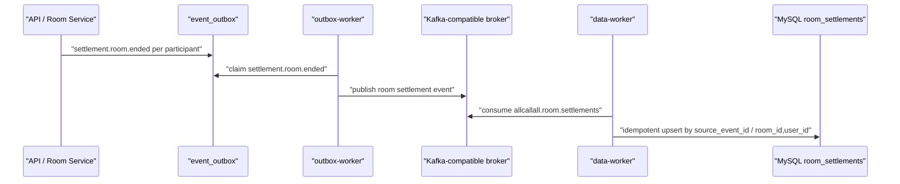
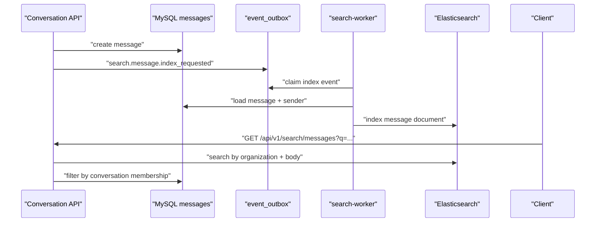

# gRPC, Kafka, and Elasticsearch Evolution

This page describes the interview-focused evolution from a modular monolith into service-oriented backend infrastructure. Kubernetes is intentionally out of scope for this stage.

## Goal

AllCallAll now demonstrates three backend interview stories:

- gRPC for synchronous service decomposition.
- Kafka-compatible messaging for async peak shaving.
- Elasticsearch for complex search over collaboration data.

The default developer path still runs as one API process. The extractable path runs separate processes for the user center, API gateway, outbox bridge, data worker, and search worker.

## Route 1: gRPC User Service

Problem:

The signaling gateway is connection-heavy. User registration, login, refresh sessions, and profile lookup are IO-heavy. Scaling both together wastes resources.

Implemented boundary:

- Contract: `/backend/proto/user/v1/user.proto`
- Hand-written gRPC binding: `/backend/internal/usergrpc/userpb/user.pb.go`
- Server implementation: `/backend/internal/usergrpc/service.go`
- Client authenticator: `/backend/internal/usergrpc/client.go`
- Entrypoint: `/backend/cmd/user-service`

Runtime behavior:

- Default API mode validates JWT locally.
- If `USER_SERVICE_GRPC_ADDR` is set, protected auth middleware calls the remote User Service over gRPC.
- This lets the API/signaling process scale independently while preserving the same external `/api/v1` surface.

Interview explanation:

> I kept the monolith runnable, then extracted the synchronous user-auth boundary first. The signaling gateway no longer needs to own user lookup logic; it can call a dedicated User Service over gRPC. This is the natural split because authentication is request-time and latency-sensitive, unlike background Agent or cleanup jobs.

## Route 2: Kafka Settlement Pipeline

Problem:

When a large meeting ends, writing every participant's settlement row synchronously can spike MySQL connections and delay the realtime path.

Implemented flow:



Code:

- MQ adapter: `/backend/internal/mq`
- Settlement service: `/backend/internal/settlement`
- Settlement model: `room_settlements`
- Kafka bridge handler: `RegisterSettlementKafkaOutboxHandlers`
- Consumer worker: `/backend/cmd/data-worker`

Idempotency:

- `event_outbox.idempotency_key` prevents duplicate enqueue.
- `room_settlements.source_event_id` prevents duplicate Kafka consumption.
- `(room_id, user_id)` prevents duplicate per-participant settlement rows.

Interview explanation:

> I do not write settlement rows directly from the room leave path. The request path only records room lifecycle state and durable outbox events. A bridge worker publishes those events to Kafka, and a data worker consumes them at a controlled pace. This protects MySQL from disconnect storms and makes duplicate delivery safe.

## Route 4: Elasticsearch Message Search

Problem:

Message search with `LIKE '%keyword%'` does not scale and cannot support relevance ranking or future richer queries.

Implemented flow:



Code:

- Search interface and memory indexer: `/backend/internal/search/service.go`
- Elasticsearch HTTP client: `/backend/internal/search/elasticsearch.go`
- Search bridge from collaboration service: `/backend/internal/collaboration/search_bridge.go`
- Search worker: `/backend/cmd/search-worker`
- API: `GET /api/v1/search/messages?q=<keyword>&limit=20`

Security:

Search results are filtered again through conversation membership after ES returns hits. ES is treated as an index, not the authorization source of truth.

Interview explanation:

> MySQL remains the source of truth, while Elasticsearch is an eventually consistent read index. Message writes enqueue an outbox event, the search worker indexes asynchronously, and the search API applies service-layer membership checks before returning results.

## Local Commands

Run the API with embedded workers:

```bash
make run-api
```

Run extracted services:

```bash
make run-user-service
make run-outbox-worker
make run-data-worker
make run-search-worker
```

Run infra for the full interview profile:

```bash
docker compose -f infra/docker-compose.yml --profile microservices --profile interview-infra up api user-service outbox-worker data-worker search-worker kafka elasticsearch
```

Relevant environment variables:

- `USER_GRPC_ADDR=:9090` for the user service.
- `USER_SERVICE_GRPC_ADDR=user-service:9090` for the API/signaling gateway.
- `KAFKA_BROKERS=kafka:9092`
- `KAFKA_SETTLEMENT_TOPIC=allcallall.room.settlements`
- `ELASTICSEARCH_URL=http://elasticsearch:9200`
- `ELASTICSEARCH_INDEX=allcallall_messages`

## Why This Is Still A Modular Monolith

The repository intentionally keeps one codebase and one schema. That is useful for interviews because it shows an incremental migration path:

1. Define domain boundaries inside the monolith.
2. Add executable service entrypoints.
3. Move request-time calls to gRPC.
4. Move bursty side effects to Kafka.
5. Move complex read queries to Elasticsearch.
6. Split databases only after ownership and traffic justify it.

This avoids the common anti-pattern of creating many tiny services before the boundaries are stable.
