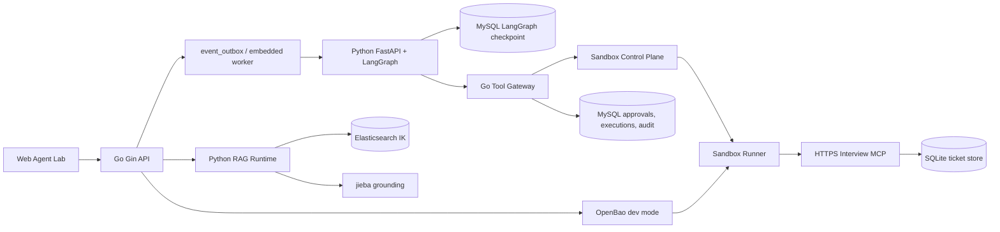
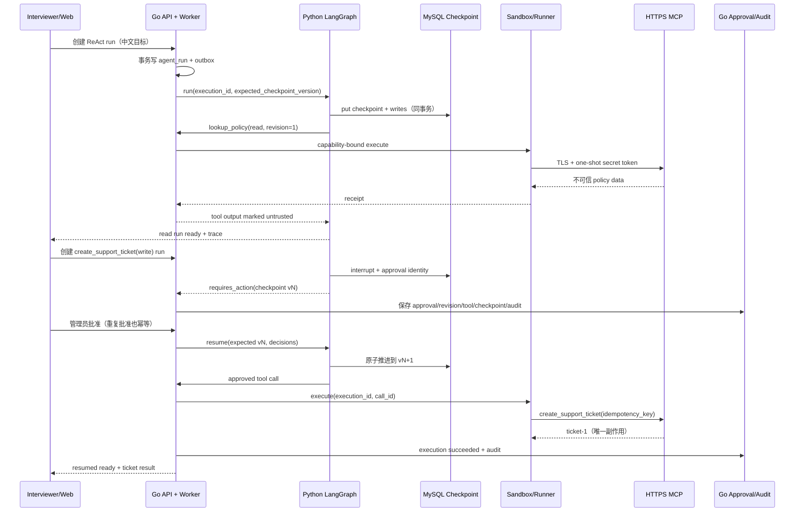

# AllCallAll 面试级主演示链路

本文是当前仓库的事实基线。它描述的是可以在全新 Docker 环境中执行的
`make interview-demo` 链路；Kubernetes/gVisor、外部 OpenBao、真实 LLM 和 Kafka
属于生产演进设计，不应在现场演示中说成已经由 Compose 验收。

## 一句话定位

AllCallAll 是一个以 Go/MySQL 为业务权威、以 Python/LangGraph 为图节点与
checkpoint 权威、以 Go Tool Gateway 为唯一工具出口的企业 Agent 工具平台。
它把“读工具自动执行”和“写工具审批后恢复”放在同一条可审计链路里。

## 当前可运行架构



Compose 的服务和端口如下：

| 服务 | 端口 | 当前职责 |
| --- | ---: | --- |
| Web | `3000` | 唯一主演示端：安装、工具目录、Agent Lab、审批和 trace |
| Go API | `18080` | 认证、组织权限、业务状态、审批、审计、工具网关、outbox |
| Agent Runtime | `18090` | LangGraph graph、规则 Provider、checkpoint 读写、interrupt/resume |
| RAG Runtime | `18091` | 检索桥接、source filter、jieba grounding、RAG 指标 |
| Sandbox Control Plane | `18092` | 安装验证、capability、Runner 调度边界 |
| Sandbox Runner | `18093` | TLS/SSRF/secret unwrap 校验和 MCP 执行 |
| Elasticsearch | `19200` | IK analyzer 与 `allcallall_context_chunks` 搜索读模型 |
| Interview MCP | 容器内 `8443` | 本地 CA 签发的 HTTPS MCP，持久化 SQLite 工单 |

### Go 与 Python 权威边界

| 数据/动作 | 权威方 | 另一方允许做什么 | 不能做什么 |
| --- | --- | --- | --- |
| 用户、组织、conversation、审批、audit | Go/MySQL | Python 只读请求上下文 | Python 不改业务状态或跳过审批 |
| Agent graph 节点进度、interrupt、checkpoint writes | Python/MySQL saver | Go 携带 `execution_id` 和 expected version 协调 | Go 不重写 Python state |
| MCP installation/revision/tool 风险 | Go/MySQL | Runner 只接收固定 revision 的 capability | Python 不直接安装或发现 MCP |
| 工具执行与外部副作用 | Go Gateway + Runner/MCP | Python 产生结构化 tool call | Python 不访问 Vault、Sandbox 或用户 MCP |
| RAG 索引源数据 | Go/MySQL | Python RAG 做 bounded retrieval/grounding | RAG 不回退到未授权 source |

关键契约：每次 run 都有确定性的 `(run_id, execution_id, call_id)`；每次
checkpoint 都有 `checkpoint_id/checkpoint_version`。相同 execution 重试返回原结果，
版本冲突返回 `409 checkpoint_version_conflict`，revision 漂移失败关闭。

## 主演示时序



## 两次现场运行

### 只读运行

目标中显式写 `mcp.1.lookup_policy`。规则 Provider 生成稳定参数；`read` 工具
不进入审批，返回内容在 trace 和 Agent context 中标记为 `mcp_untrusted`。这证明
工具结果不会覆盖 system policy，也证明 revision/tool identity 被保留下来。

### 写入运行

目标中显式写 `mcp.1.create_support_ticket`。LangGraph 在 tool node 产生
`interrupt`，Go 展示 MCP installation、revision、checkpoint version 和审批原因。
批准后重启 Agent Runtime，再由 `interview-chaos` 调用 resume；最终 MCP SQLite
中只有一个 `idempotency_key` 和一个外部 ticket。

## 关键数据关系

```text
organizations
  -> conversations
      -> agent_runs
          -> agent_steps
          -> agent_tool_calls
          -> tool_approvals
          -> event_outbox

mcp_installations
  -> mcp_installation_revisions
      -> mcp_tools
          -> mcp_executions

agent_runs
  -> langgraph_checkpoints(thread_id, checkpoint_ns, checkpoint_id)
      -> langgraph_checkpoint_writes(task_id, task_path, write_index)

rag_sources -> rag_source_versions -> rag_chunks -> Elasticsearch read model
```

业务表存状态和审计；checkpoint 表只存 Python graph 恢复所需的 typed JSON/blob；
MCP execution 保存 capability 绑定的 installation revision、tool id、run/call identity
和 receipt，不保存 secret value。

## 安全边界

- Compose 的 JWT、OpenBao token、Ed25519 capability keypair、本地 CA 和 MCP bearer
  token 生成到 `/tmp/allcallall-interview-*`，目录 `0700`、文件 `0600`，不进入 Git。
- Interview MCP 只信任显式 `interview-mcp` DNS 和本地 CA；拒绝 IP、wildcard、重定向、
  私网非 allowlist 主机和 TLS 证书不匹配。
- Go 发放短期 capability；claims 绑定 organization/user/conversation/run、revision、
  tool 集合、audience 和 expiry。Runner 每次执行重新检查 capability 和 revision。
- OpenBao 只返回一次性 response-wrapping token；Runner 在 tmpfs 解包，日志、trace、
  checkpoint 和 MySQL 都不能出现 secret value。
- MCP 输出是不可信数据。它可以作为 evidence/citation，但不能修改 system policy、
  tool risk 或 approval decision。
- Compose 使用 OpenBao dev mode 和 interview 私网信任仅为演示便利；生产边界应换成
  外部 OpenBao、Kubernetes NetworkPolicy、非 root、只读 rootfs、seccomp、drop capabilities
  和 gVisor RuntimeClass。

## 故障矩阵

| 故障注入 | 预期结果 | 可观察证据 |
| --- | --- | --- |
| Agent Runtime Pod/容器重启 | 从 MySQL checkpoint resume，不重建工单 | `checkpoint_id/version`、`mcp_executions=1` |
| 重复提交同一 run | 返回原 run，不新增 outbox/run | `(organization,user,conversation,dedupe_key)` 唯一约束 |
| 重复 approval | 返回已有 decision，不重复 resume | approval audit 与 execution 数量不变 |
| 重复 execution | 返回原 receipt，不重复 MCP 副作用 | `execution_id` + MCP SQLite unique key |
| checkpoint version 过期 | `409 checkpoint_version_conflict`，原状态不变 | Agent metric conflict counter |
| revision 漂移 | capability/tool binding 拒绝，execution failed closed | Go audit 的 revision mismatch |
| 跨组织/过期 capability | `403/401`，不触达 Runner/MCP | Go gateway audit + Runner counter |
| MCP 私网 SSRF/重定向 | validate 阶段拒绝安装 | Control Plane validation error |
| 超时或超大输出 | Runner failed/timed_out，不写业务成功状态 | Runner metrics、execution status |

## 现场命令与验收

```bash
make interview-demo       # up -> smoke，打印 Web URL 和登录信息
make interview-smoke      # 服务、IK、RAG filter、jieba、metrics、secret 泄漏检查
make interview-chaos      # 重启 Agent Runtime，批准后验证 checkpoint resume
make interview-down       # 停止 Compose 并清理临时状态
```

当前 smoke 的成功输出应包含：

```text
smoke passed: stack, metrics, Elasticsearch IK, RAG source filter, and jieba grounding
read chain passed: ... MCP output marked untrusted ...
write chain passed: ... resumed from checkpoint ... external_tickets=1
```

离线回归命令：

```bash
make agent-demo-report
make resume-eval
make python-agent-eval
make python-rag-eval
make interview-bench
```

生成报告是确定性 `rules` fixture 证据，不代表开放域模型质量。真实模型必须通过
OpenAI-compatible 配置显式启用，并在 strict mode 下失败关闭。

## 诚实边界

已经在当前链路验证的内容：Go/Python/DB checkpoint、MCP HTTPS/TLS、OpenBao wrapping、
Sandbox receipt、审批恢复、幂等副作用、IK/jieba、Web trace 和多视口 E2E。

保留为生产设计或模板验证、未作为 Compose 成功条件的内容：外部 OpenBao、Kubernetes
NetworkPolicy/gVisor、OCI Trivy/SBOM 全链路、多副本 HPA/PDB、真实 LLM 质量和 Kafka
生产吞吐。面试时明确区分“已运行验证”和“设计约束”，可信度高于报出无法复现的 SLA。
