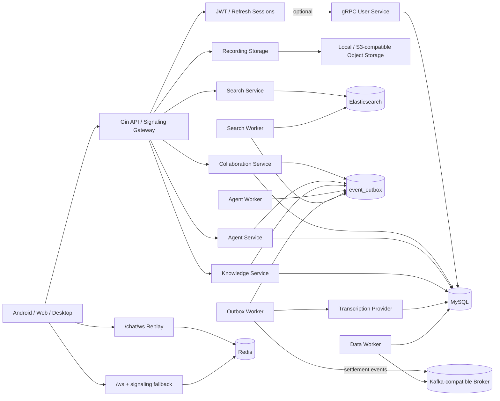
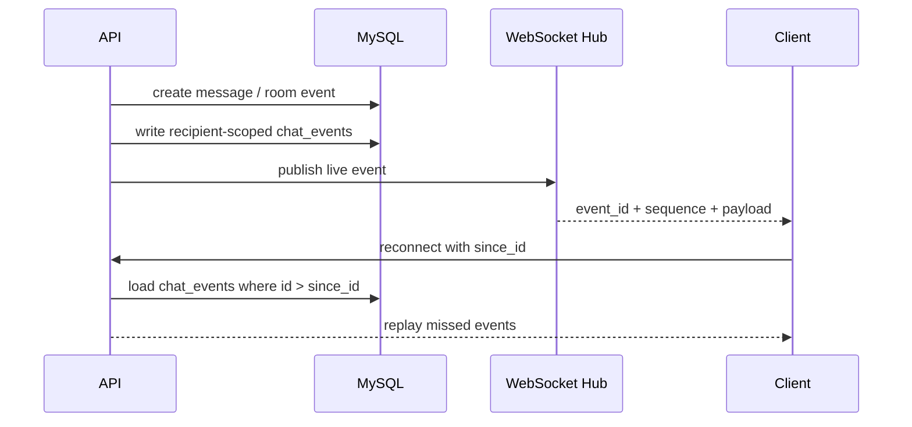
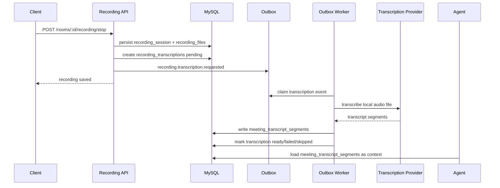
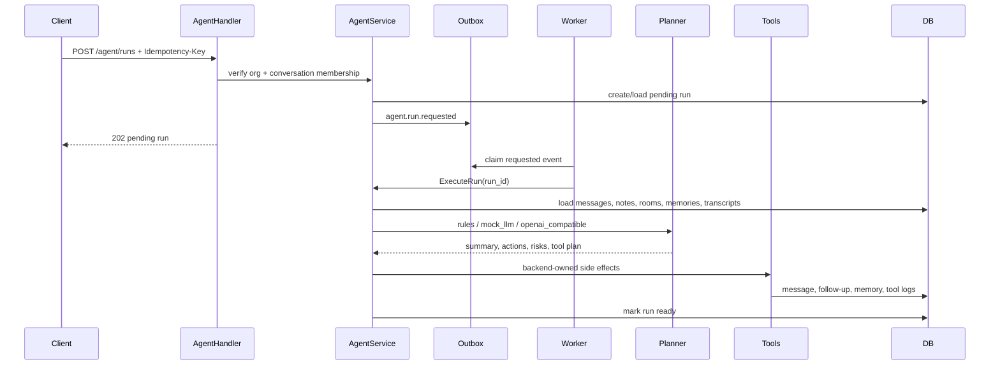

# System Design: AI-Powered Realtime Collaboration Backend

AllCallAll is best presented as a backend system-design case study: realtime collaboration, WebRTC meetings, recording storage/transcription, AI Agent execution, durable outbox workers, and a microservice-friendly evolution path.

## Problem Statement

Build a collaboration backend where teams can work in organization-scoped conversations, escalate a thread into a meeting, preserve recording assets, transcribe meeting recordings, search historical context, and run an Agent that produces summaries, risks, action items, and follow-ups.

## High-Level Architecture

## Core Data Domains

- Identity/security: `users`, `refresh_sessions`, `email_verification_codes`, `push_devices`.
- Collaboration: `organizations`, `organization_members`, `conversations`, `messages`, `conversation_notes`, `chat_events`.
- Meetings: `call_rooms`, `call_room_members`, `call_room_events`.
- Recording/transcription: `recording_sessions`, `recording_files`, `recording_transcriptions`, `meeting_transcript_segments`, `recording_exports`.
- Agent/workflow/RAG: `agent_runs`, `agent_steps`, `agent_tool_calls`, `agent_memories`, `agent_context_chunks`, `workflow_*`, `rag_*`, `tool_approvals`.
- Async backbone: `event_outbox`.
- Infra read/write models: `room_settlements`, Elasticsearch message/chunk indexes.

## Realtime Flow

Design points:

- `/api/v1/chat/ws` is collaboration replay.
- `/api/v1/ws` and `/api/v1/signaling/*` are 1:1 WebRTC signaling.
- `sequence` mirrors durable event ordering.
- Per-recipient events keep reconnect replay authorization-friendly.

## Recording Transcription Flow

v1 uses `TRANSCRIPTION_PROVIDER=mock` and requires locally readable recording files. S3-only files are marked failed until Reader/download support is implemented. This path is independent of realtime translation, whose UI is currently hidden.

## Agent Execution Flow

The Agent sees both older 1:1 `call_transcript_segments` and newer meeting recording `meeting_transcript_segments`, with separate source attribution.

## gRPC, Kafka, Elasticsearch

- gRPC: `USER_SERVICE_GRPC_ADDR` switches API auth validation to the extracted User Service.
- Kafka: room-ended events go outbox -> Kafka -> `data-worker` -> `room_settlements`.
- Elasticsearch: message creation goes outbox -> `search-worker` -> ES; query results are re-authorized through MySQL membership checks.

## Reliability Choices

- Service-layer permission checks are repeated after handler auth.
- `X-Request-ID` is propagated through HTTP errors, Agent runs, and outbox rows.
- Outbox rows use idempotency keys, attempts, and claim leases.
- Agent runs use idempotency keys plus `attempts`/`lease_until`.
- Recording transcription failure does not undo recording persistence.
- WebSocket replay is durable, not only in-memory.
- Kafka consumers and message fan-out are idempotent.
- ES is a read model, never the authorization boundary.

## Tradeoffs

- Single repo and shared schema keep demos runnable.
- Extracted workers/gRPC/Kafka/ES prove boundaries without forcing a full service mesh.
- Kubernetes, real ASR, and S3 transcription reads are future enhancements.
- Current media layer is enough for signaling/meeting-state/recording demos, not a production SFU claim.
