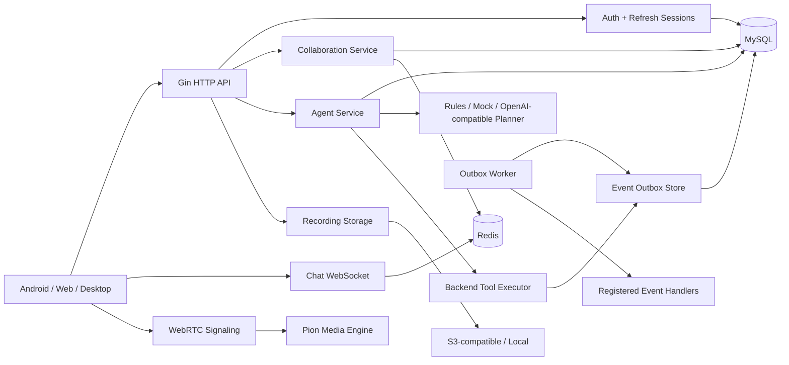
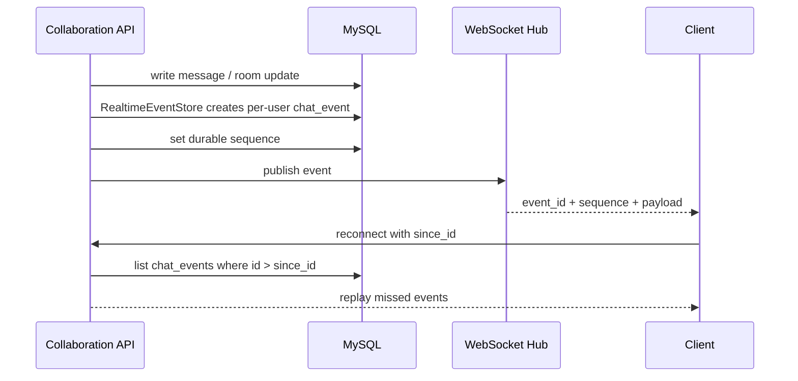
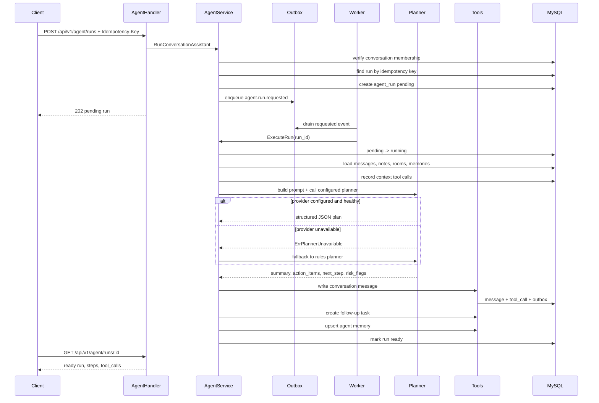

# System Design: AI-Powered Realtime Collaboration Backend

This page frames AllCallAll like a system-design interview. The project is not presented as a finished product here; it is a backend engineering case study.

## Problem Statement

Build a realtime collaboration backend for cross-border support teams. Users can join organizations, work in conversation threads, escalate a thread into a meeting, receive realtime updates, store recording assets, and run an AI Agent after meetings to produce action items.

## High-Level Architecture



## Core Data Domains

- Identity: `users`, `refresh_sessions`
- Organization: `organizations`, `organization_members`, `organization_policies`
- Collaboration: `conversations`, `conversation_members`, `messages`, `conversation_notes`
- Realtime: `chat_events` with explicit `sequence` for replay and acknowledgement semantics
- Meeting: `call_rooms`, `call_room_members`, `call_room_events`
- Recording: `recording_sessions`, `recording_files`, `recording_exports`
- Agent: `agent_runs`, `agent_steps`, `agent_tool_calls`, `agent_memories`
- Reliability: `event_outbox`

## Realtime Event Flow



Design notes:

- `event_id` remains backward compatible and is still used by `since_id` replay.
- `sequence` makes the event stream explicit for client ack/replay logic. In the current implementation it mirrors the persisted event row ID, which keeps ordering durable without introducing a separate stream service.
- Durable `chat_events` are the source of truth when WebSocket delivery is missed.
- `RealtimeEventStore` isolates create/list mechanics from collaboration orchestration, making replay behavior independently testable.
- `/api/v1/chat/ws` is the collaboration replay channel. `/api/v1/ws` and `/api/v1/signaling/*` are separate WebRTC signaling paths and should not be conflated with chat replay.
- `ChatHub` uses a replay-capable send buffer sized above the current backlog limit, so reconnect replay does not silently drop the 100-event catch-up batch before clients can drain it.

## Agent Execution Flow



Provider contract:

- `rules`: deterministic default, safest for tests and offline demos.
- `mock_llm`: builds prompt, estimates tokens, returns structured JSON, and parses it back without external credentials.
- `openai_compatible`: calls a configured Chat Completions-compatible endpoint when `AGENT_OPENAI_BASE_URL` and `AGENT_OPENAI_MODEL` are set; otherwise execution falls back to `rules` and increments fallback metrics.

## Local Evidence Command

`cmd/interview-bench` gives a fast, database-free proof of the Agent/outbox path:

```bash
cd backend
go run ./cmd/interview-bench -conversations 25 -batch-size 50
```

It seeds temporary SQLite conversations, queues Agent runs, drains `agent.run.requested`, executes backend-controlled tools, writes messages/tasks/memory, and prints JSON counts and latency summaries. This is not a production load test, but it is a strong interview demo because it exercises real code rather than a mocked happy path.

Realtime replay evidence commands:

```bash
make realtime-replay-bench
make chat-ws-replay-bench
```

`realtime-replay-bench` proves durable store-level scope, sequence, `since_id`, and replay-limit behavior. `chat-ws-replay-bench` starts an in-process authenticated Gin/WebSocket server and verifies the real `/api/v1/chat/ws` replay path with local JWT, organization membership, concurrent clients, and connect-to-first/last-event latency.

## Reliability Choices

- Service-layer permission checks are repeated even when handlers already authenticate.
- Agent run idempotency prevents repeated pending jobs and tool side effects during retry.
- Outbox records durable side effects for async event delivery; enqueue uses an idempotency key so retries do not create duplicate domain events.
- The outbox worker drains pending rows, calls registered handlers, applies retry delay and max-attempt limits, and emits publish/retry/failure metrics.
- WebSocket replay reduces dependency on perfect long-lived connections.
- Recording storage has local and S3-compatible drivers.

## Interview Tradeoffs

- Current Agent execution remains deterministic by default; `mock_llm` demonstrates structured-output parsing without external credentials, and `openai_compatible` supports real model-backed planning without making tests depend on external services.
- Current outbox has a lightweight processor with registered handlers, configurable interval, batch size, retry delay, max attempts, and publish/failure metrics. Registered production handlers execute `agent.run.requested`, observe `agent.run.completed`, and observe `message.created`; production systems can replace handlers with Kafka/Redis Streams publishers.
- Current realtime replay uses MySQL-backed event records; Redis Streams can be introduced if throughput requires it.
- Current media layer is sufficient for demonstrating WebRTC signaling and room state, not a production-grade Zoom-scale SFU.
