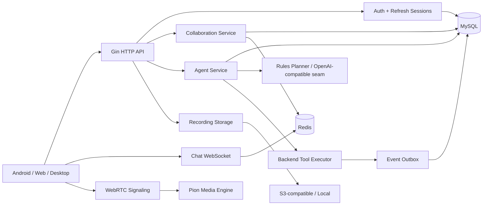
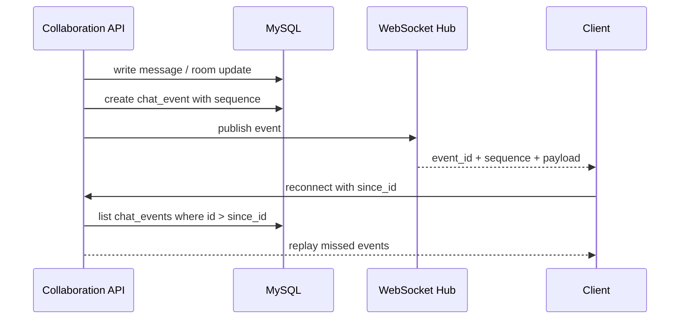
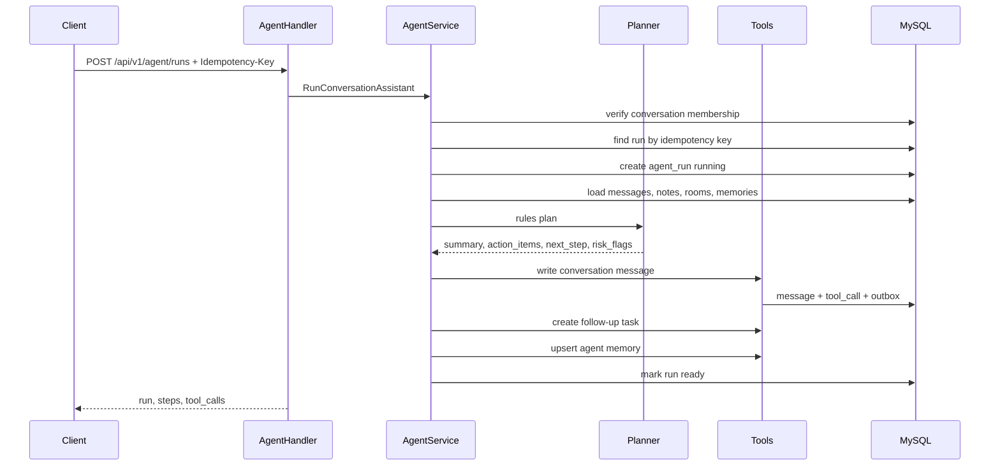

# System Design: AI-Powered Realtime Collaboration Backend

This page frames AllCallAll like a system-design interview. The project is not presented as a finished commercial app here; it is a backend engineering case study.

## Problem Statement

Build a realtime collaboration backend for cross-border support teams. Users can join organizations, work in conversation threads, escalate a thread into a meeting, receive realtime updates, store recording assets, and run an AI Agent after meetings to produce action items.

## High-Level Architecture

## Core Data Domains

- Identity: `users`, `refresh_sessions`
- Organization: `organizations`, `organization_members`, `organization_policies`
- Collaboration: `conversations`, `conversation_members`, `messages`, `conversation_notes`
- Realtime: `chat_events` with explicit `sequence` for replay and acknowledgement semantics
- Meeting: `call_rooms`, `call_room_members`, `call_room_events`
- Recording: `recording_sessions`, `recording_files`, `recording_exports`
- Agent: `agent_runs`, `agent_steps`, `agent_tool_calls`, `agent_memories`
- Reliability: `event_outbox`

## Realtime Event Flow

Design notes:

- `event_id` remains backward compatible.
- `sequence` makes the event stream explicit for client ack/replay logic.
- Durable `chat_events` are the source of truth when WebSocket delivery is missed.

## Agent Execution Flow

## Reliability Choices

- Service-layer permission checks are repeated even when handlers already authenticate.
- Agent run idempotency prevents repeated tool side effects during retry.
- Outbox records durable side effects for async event delivery.
- WebSocket replay reduces dependency on perfect long-lived connections.
- Recording storage has local and S3-compatible drivers.

## Interview Tradeoffs

- Current Agent provider is deterministic for tests; an LLM provider is a replaceable seam.
- Current outbox is persisted but not yet backed by a dedicated publisher worker.
- Current realtime replay uses MySQL-backed event records; Redis Streams can be introduced if throughput requires it.
- Current media layer is sufficient for demonstrating WebRTC signaling and room state, not a production-grade Zoom-scale SFU.
